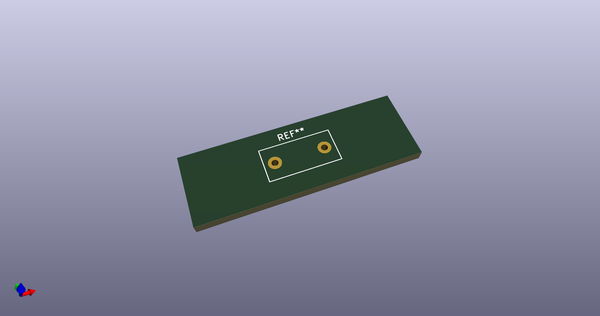
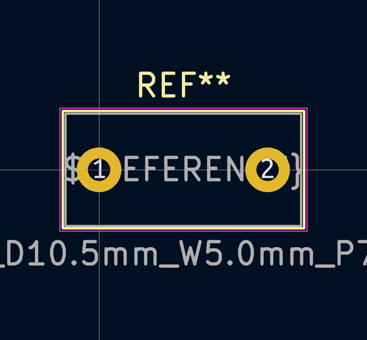
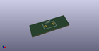

# OOMP Footprint  
## C_Disc_D10.5mm_W5.0mm_P7.50mm  by none  
  
oomp key: oomp_kicad_capacitor_tht_c_disc_d10_5mm_w5_0mm_p7_50mm  
  
source repo at: [http://gitlab.com/kicad/kicad-footprints/blob/master/tmp/data//oomlout_oomp_footprint_src/Varistor.pretty/RV_Rect_V25S440P_L26.5mm_W8.2mm_P12.7mm.kicad_mod](http://gitlab.com/kicad/kicad-footprints/blob/master/tmp/data//oomlout_oomp_footprint_src/Varistor.pretty/RV_Rect_V25S440P_L26.5mm_W8.2mm_P12.7mm.kicad_mod)  
## Footprint  
  
  
  
  
| name | value | 
| --- | --- | 
| footprint name | C_Disc_D10.5mm_W5.0mm_P7.50mm | 
| footprint description | C, Disc series, Radial, pin pitch=7.50mm, , diameter*width=10.5*5.0mm^2, Capacitor, http://www.vishay.com/docs/28535/vy2series.pdf | 
| number of pads | 2 | 
| github path | http://github.com/kicad/kicad-footprints/blob/master/tmp/data//oomlout_oomp_footprint_src/Capacitor_THT.pretty/C_Disc_D10.5mm_W5.0mm_P7.50mm.kicad_mod | 
| oomp key | oomp_kicad_capacitor_tht_c_disc_d10_5mm_w5_0mm_p7_50mm | 
| oomp bot github | https://github.com/oomlout/oomlout_oomp_footprint_bot/tree/main/tmp/data//oomlout_oomp_footprint_src/footprints/kicad_capacitor_tht_c_disc_d10_5mm_w5_0mm_p7_50mm/working | 
## Images  
  
  
  
  
  
  
  
  
