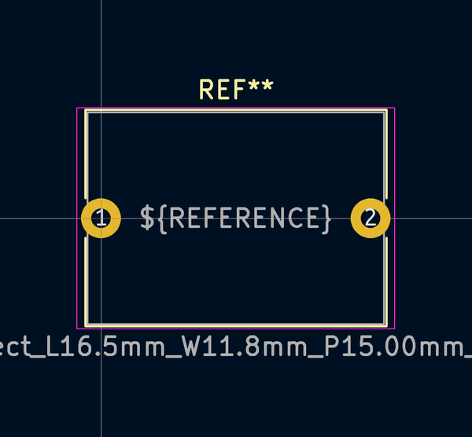
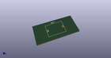

# OOMP Footprint  
## C_Rect_L16.5mm_W11.8mm_P15.00mm_MKT  by none  
  
oomp key: oomp_kicad_capacitor_tht_c_rect_l16_5mm_w11_8mm_p15_00mm_mkt  
  
source repo at: [http://gitlab.com/kicad/kicad-footprints/blob/master/tmp/data//oomlout_oomp_footprint_src/Varistor.pretty/RV_Rect_V25S440P_L26.5mm_W8.2mm_P12.7mm.kicad_mod](http://gitlab.com/kicad/kicad-footprints/blob/master/tmp/data//oomlout_oomp_footprint_src/Varistor.pretty/RV_Rect_V25S440P_L26.5mm_W8.2mm_P12.7mm.kicad_mod)  
## Footprint  
  
  
  
  
| name | value | 
| --- | --- | 
| footprint name | C_Rect_L16.5mm_W11.8mm_P15.00mm_MKT | 
| footprint description | C, Rect series, Radial, pin pitch=15.00mm, , length*width=16.5*11.8mm^2, Capacitor, https://en.tdk.eu/inf/20/20/db/fc_2009/MKT_B32560_564.pdf | 
| number of pads | 2 | 
| github path | http://github.com/kicad/kicad-footprints/blob/master/tmp/data//oomlout_oomp_footprint_src/Capacitor_THT.pretty/C_Rect_L16.5mm_W11.8mm_P15.00mm_MKT.kicad_mod | 
| oomp key | oomp_kicad_capacitor_tht_c_rect_l16_5mm_w11_8mm_p15_00mm_mkt | 
| oomp bot github | https://github.com/oomlout/oomlout_oomp_footprint_bot/tree/main/tmp/data//oomlout_oomp_footprint_src/footprints/kicad_capacitor_tht_c_rect_l16_5mm_w11_8mm_p15_00mm_mkt/working | 
## Images  
  
  
  
  
  
  
  
  
