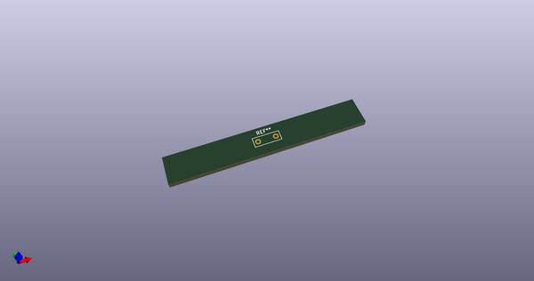
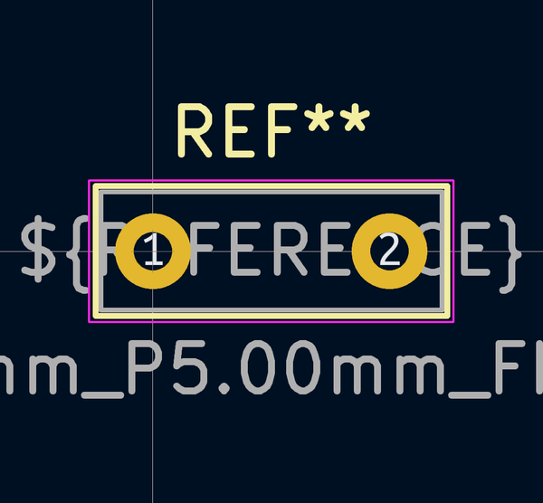
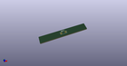

# OOMP Footprint  
## C_Rect_L7.2mm_W2.5mm_P5.00mm_FKS2_FKP2_MKS2_MKP2  by none  
  
oomp key: oomp_kicad_capacitor_tht_c_rect_l7_2mm_w2_5mm_p5_00mm_fks2_fkp2_mks2_mkp2  
  
source repo at: [http://gitlab.com/kicad/kicad-footprints/blob/master/tmp/data//oomlout_oomp_footprint_src/Varistor.pretty/RV_Rect_V25S440P_L26.5mm_W8.2mm_P12.7mm.kicad_mod](http://gitlab.com/kicad/kicad-footprints/blob/master/tmp/data//oomlout_oomp_footprint_src/Varistor.pretty/RV_Rect_V25S440P_L26.5mm_W8.2mm_P12.7mm.kicad_mod)  
## Footprint  
  
  
  
  
| name | value | 
| --- | --- | 
| footprint name | C_Rect_L7.2mm_W2.5mm_P5.00mm_FKS2_FKP2_MKS2_MKP2 | 
| footprint description | C, Rect series, Radial, pin pitch=5.00mm, , length*width=7.2*2.5mm^2, Capacitor, http://www.wima.com/EN/WIMA_FKS_2.pdf | 
| number of pads | 2 | 
| github path | http://github.com/kicad/kicad-footprints/blob/master/tmp/data//oomlout_oomp_footprint_src/Capacitor_THT.pretty/C_Rect_L7.2mm_W2.5mm_P5.00mm_FKS2_FKP2_MKS2_MKP2.kicad_mod | 
| oomp key | oomp_kicad_capacitor_tht_c_rect_l7_2mm_w2_5mm_p5_00mm_fks2_fkp2_mks2_mkp2 | 
| oomp bot github | https://github.com/oomlout/oomlout_oomp_footprint_bot/tree/main/tmp/data//oomlout_oomp_footprint_src/footprints/kicad_capacitor_tht_c_rect_l7_2mm_w2_5mm_p5_00mm_fks2_fkp2_mks2_mkp2/working | 
## Images  
  
  
  
  
  
  
  
  
