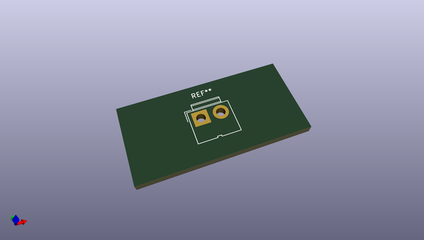
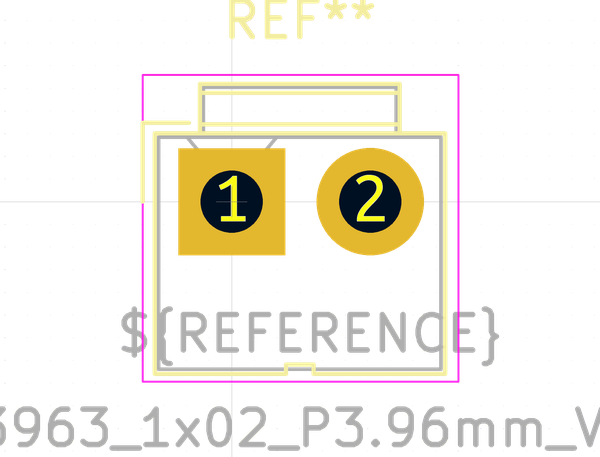
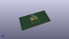

# OOMP Footprint  
## JWT_A3963_1x02_P3.96mm_Vertical  by none  
  
oomp key: oomp_kicad_connector_jwt_a3963_1x02_p3_96mm_vertical  
  
source repo at: [http://gitlab.com/kicad/kicad-footprints/blob/master/tmp/data//oomlout_oomp_footprint_src/Varistor.pretty/RV_Rect_V25S440P_L26.5mm_W8.2mm_P12.7mm.kicad_mod](http://gitlab.com/kicad/kicad-footprints/blob/master/tmp/data//oomlout_oomp_footprint_src/Varistor.pretty/RV_Rect_V25S440P_L26.5mm_W8.2mm_P12.7mm.kicad_mod)  
## Footprint  
  
  
  
  
| name | value | 
| --- | --- | 
| footprint name | JWT_A3963_1x02_P3.96mm_Vertical | 
| footprint description | JWT A3963, 3.96mm pitch Pin head connector (http://www.jwt.com.tw/pro_pdf/A3963.pdf) | 
| number of pads | 2 | 
| github path | http://github.com/kicad/kicad-footprints/blob/master/tmp/data//oomlout_oomp_footprint_src/Connector.pretty/JWT_A3963_1x02_P3.96mm_Vertical.kicad_mod | 
| oomp key | oomp_kicad_connector_jwt_a3963_1x02_p3_96mm_vertical | 
| oomp bot github | https://github.com/oomlout/oomlout_oomp_footprint_bot/tree/main/tmp/data//oomlout_oomp_footprint_src/footprints/kicad_connector_jwt_a3963_1x02_p3_96mm_vertical/working | 
## Images  
  
  
  
  
  
  
  
  
