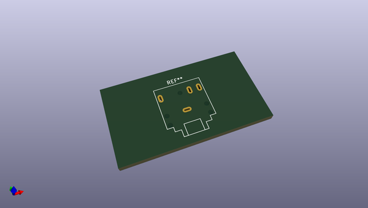
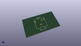
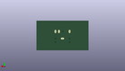
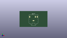

# OOMP Footprint  
## Jack_3.5mm_CUI_SJ1-3524N_Horizontal  by none  
  
oomp key: oomp_kicad_connector_audio_jack_3_5mm_cui_sj1_3524n_horizontal  
  
source repo at: [http://gitlab.com/kicad/kicad-footprints/blob/master/tmp/data//oomlout_oomp_footprint_src/Varistor.pretty/RV_Rect_V25S440P_L26.5mm_W8.2mm_P12.7mm.kicad_mod](http://gitlab.com/kicad/kicad-footprints/blob/master/tmp/data//oomlout_oomp_footprint_src/Varistor.pretty/RV_Rect_V25S440P_L26.5mm_W8.2mm_P12.7mm.kicad_mod)  
## Footprint  
  
  
  
  
| name | value | 
| --- | --- | 
| footprint name | Jack_3.5mm_CUI_SJ1-3524N_Horizontal | 
| footprint description | TRS 3.5mm, horizontal, through-hole, https://www.cuidevices.com/product/resource/pdf/sj1-352xn.pdf | 
| number of pads | 9 | 
| github path | http://github.com/kicad/kicad-footprints/blob/master/tmp/data//oomlout_oomp_footprint_src/Connector_Audio.pretty/Jack_3.5mm_CUI_SJ1-3524N_Horizontal.kicad_mod | 
| oomp key | oomp_kicad_connector_audio_jack_3_5mm_cui_sj1_3524n_horizontal | 
| oomp bot github | https://github.com/oomlout/oomlout_oomp_footprint_bot/tree/main/tmp/data//oomlout_oomp_footprint_src/footprints/kicad_connector_audio_jack_3_5mm_cui_sj1_3524n_horizontal/working | 
## Images  
  
  
  
  
  
  
  
  
