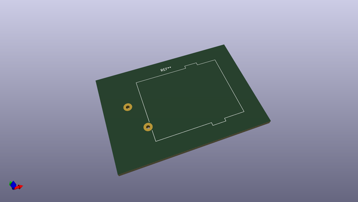
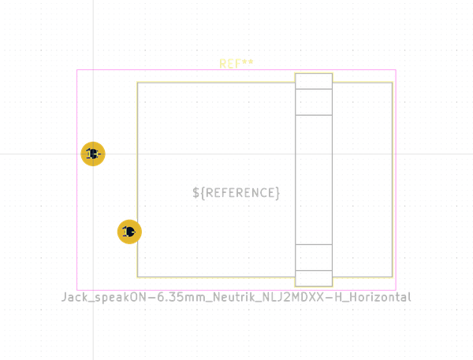
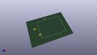
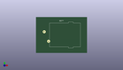

# OOMP Footprint  
## Jack_speakON-6.35mm_Neutrik_NLJ2MDXX-H_Horizontal  by none  
  
oomp key: oomp_kicad_connector_audio_jack_speakon_6_35mm_neutrik_nlj2mdxx_h_horizontal  
  
source repo at: [http://gitlab.com/kicad/kicad-footprints/blob/master/tmp/data//oomlout_oomp_footprint_src/Varistor.pretty/RV_Rect_V25S440P_L26.5mm_W8.2mm_P12.7mm.kicad_mod](http://gitlab.com/kicad/kicad-footprints/blob/master/tmp/data//oomlout_oomp_footprint_src/Varistor.pretty/RV_Rect_V25S440P_L26.5mm_W8.2mm_P12.7mm.kicad_mod)  
## Footprint  
  
  
  
  
| name | value | 
| --- | --- | 
| footprint name | Jack_speakON-6.35mm_Neutrik_NLJ2MDXX-H_Horizontal | 
| footprint description | speakON Combo, 2 pole combination of speakON socket and 6.35mm (1/4in) jack receptacle, horizontal pcb mount, replaces NLJ2MD-H, https://www.neutrik.com/en/product/nlj2mdxx-h | 
| number of pads | 2 | 
| github path | http://github.com/kicad/kicad-footprints/blob/master/tmp/data//oomlout_oomp_footprint_src/Connector_Audio.pretty/Jack_speakON-6.35mm_Neutrik_NLJ2MDXX-H_Horizontal.kicad_mod | 
| oomp key | oomp_kicad_connector_audio_jack_speakon_6_35mm_neutrik_nlj2mdxx_h_horizontal | 
| oomp bot github | https://github.com/oomlout/oomlout_oomp_footprint_bot/tree/main/tmp/data//oomlout_oomp_footprint_src/footprints/kicad_connector_audio_jack_speakon_6_35mm_neutrik_nlj2mdxx_h_horizontal/working | 
## Images  
  
  
  
  
  
  
  
  
