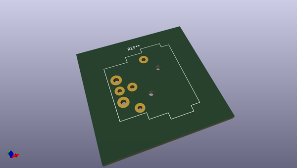
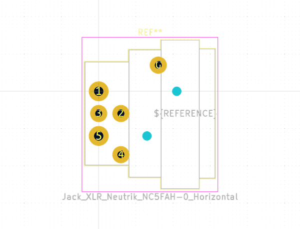
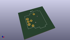
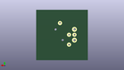
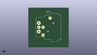

# OOMP Footprint  
## Jack_XLR_Neutrik_NC5FAH-0_Horizontal  by none  
  
oomp key: oomp_kicad_connector_audio_jack_xlr_neutrik_nc5fah_0_horizontal  
  
source repo at: [http://gitlab.com/kicad/kicad-footprints/blob/master/tmp/data//oomlout_oomp_footprint_src/Varistor.pretty/RV_Rect_V25S440P_L26.5mm_W8.2mm_P12.7mm.kicad_mod](http://gitlab.com/kicad/kicad-footprints/blob/master/tmp/data//oomlout_oomp_footprint_src/Varistor.pretty/RV_Rect_V25S440P_L26.5mm_W8.2mm_P12.7mm.kicad_mod)  
## Footprint  
  
  
  
  
| name | value | 
| --- | --- | 
| footprint name | Jack_XLR_Neutrik_NC5FAH-0_Horizontal | 
| footprint description | A Series, 5 pole female XLR receptacle, grounding: separate ground contact to mating connector shell and front panel, horizontal PCB mount, retention spring instead of latch, https://www.neutrik.com/en/product/nc5fah-0 | 
| number of pads | 8 | 
| github path | http://github.com/kicad/kicad-footprints/blob/master/tmp/data//oomlout_oomp_footprint_src/Connector_Audio.pretty/Jack_XLR_Neutrik_NC5FAH-0_Horizontal.kicad_mod | 
| oomp key | oomp_kicad_connector_audio_jack_xlr_neutrik_nc5fah_0_horizontal | 
| oomp bot github | https://github.com/oomlout/oomlout_oomp_footprint_bot/tree/main/tmp/data//oomlout_oomp_footprint_src/footprints/kicad_connector_audio_jack_xlr_neutrik_nc5fah_0_horizontal/working | 
## Images  
  
  
  
  
  
  
  
  
