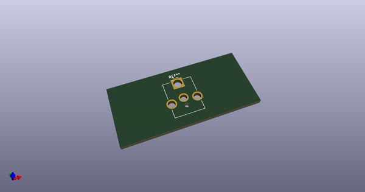
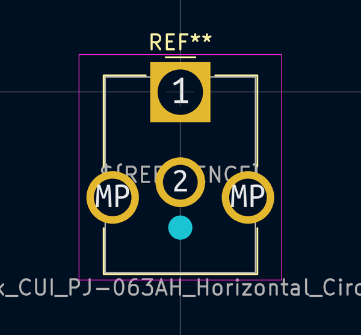
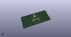
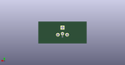
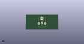

# OOMP Footprint  
## BarrelJack_CUI_PJ-063AH_Horizontal_CircularHoles  by none  
  
oomp key: oomp_kicad_connector_barreljack_barreljack_cui_pj_063ah_horizontal_circularholes  
  
source repo at: [http://gitlab.com/kicad/kicad-footprints/blob/master/tmp/data//oomlout_oomp_footprint_src/Varistor.pretty/RV_Rect_V25S440P_L26.5mm_W8.2mm_P12.7mm.kicad_mod](http://gitlab.com/kicad/kicad-footprints/blob/master/tmp/data//oomlout_oomp_footprint_src/Varistor.pretty/RV_Rect_V25S440P_L26.5mm_W8.2mm_P12.7mm.kicad_mod)  
## Footprint  
  
  
  
  
| name | value | 
| --- | --- | 
| footprint name | BarrelJack_CUI_PJ-063AH_Horizontal_CircularHoles | 
| footprint description | Barrel Jack, 2.0mm ID, 5.5mm OD, 24V, 8A, no switch, https://www.cui.com/product/resource/pj-063ah.pdf | 
| number of pads | 5 | 
| github path | http://github.com/kicad/kicad-footprints/blob/master/tmp/data//oomlout_oomp_footprint_src/Connector_BarrelJack.pretty/BarrelJack_CUI_PJ-063AH_Horizontal_CircularHoles.kicad_mod | 
| oomp key | oomp_kicad_connector_barreljack_barreljack_cui_pj_063ah_horizontal_circularholes | 
| oomp bot github | https://github.com/oomlout/oomlout_oomp_footprint_bot/tree/main/tmp/data//oomlout_oomp_footprint_src/footprints/kicad_connector_barreljack_barreljack_cui_pj_063ah_horizontal_circularholes/working | 
## Images  
  
  
  
  
  
  
  
  
