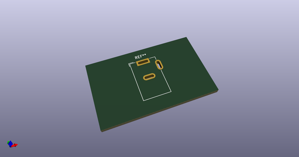
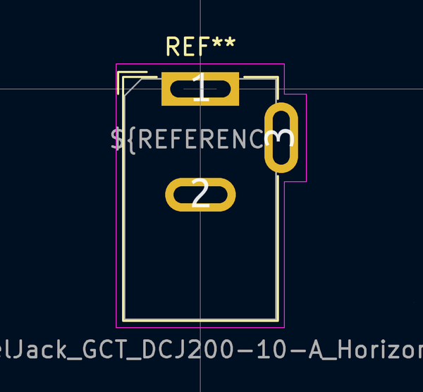
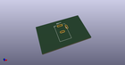
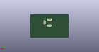
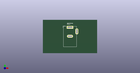

# OOMP Footprint  
## BarrelJack_GCT_DCJ200-10-A_Horizontal  by none  
  
oomp key: oomp_kicad_connector_barreljack_barreljack_gct_dcj200_10_a_horizontal  
  
source repo at: [http://gitlab.com/kicad/kicad-footprints/blob/master/tmp/data//oomlout_oomp_footprint_src/Varistor.pretty/RV_Rect_V25S440P_L26.5mm_W8.2mm_P12.7mm.kicad_mod](http://gitlab.com/kicad/kicad-footprints/blob/master/tmp/data//oomlout_oomp_footprint_src/Varistor.pretty/RV_Rect_V25S440P_L26.5mm_W8.2mm_P12.7mm.kicad_mod)  
## Footprint  
  
  
  
  
| name | value | 
| --- | --- | 
| footprint name | BarrelJack_GCT_DCJ200-10-A_Horizontal | 
| footprint description | Barrel jack connector (5.5 mm outer diameter, 2.05 inner diameter ), https://gct.co/files/drawings/dcj200-10.pdf | 
| number of pads | 3 | 
| github path | http://github.com/kicad/kicad-footprints/blob/master/tmp/data//oomlout_oomp_footprint_src/Connector_BarrelJack.pretty/BarrelJack_GCT_DCJ200-10-A_Horizontal.kicad_mod | 
| oomp key | oomp_kicad_connector_barreljack_barreljack_gct_dcj200_10_a_horizontal | 
| oomp bot github | https://github.com/oomlout/oomlout_oomp_footprint_bot/tree/main/tmp/data//oomlout_oomp_footprint_src/footprints/kicad_connector_barreljack_barreljack_gct_dcj200_10_a_horizontal/working | 
## Images  
  
  
  
  
  
  
  
  
