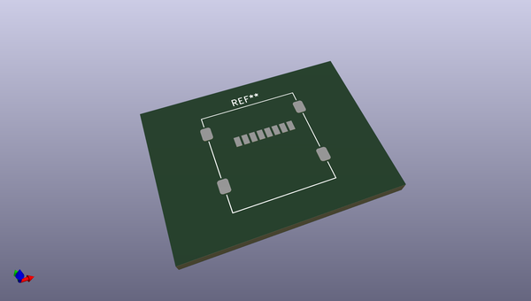
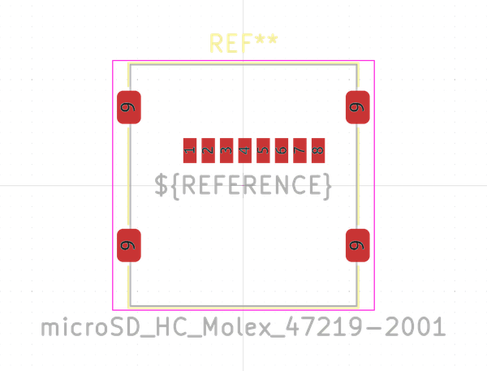
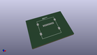
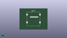

# OOMP Footprint  
## microSD_HC_Molex_47219-2001  by none  
  
oomp key: oomp_kicad_connector_card_microsd_hc_molex_47219_2001  
  
source repo at: [http://gitlab.com/kicad/kicad-footprints/blob/master/tmp/data//oomlout_oomp_footprint_src/Varistor.pretty/RV_Rect_V25S440P_L26.5mm_W8.2mm_P12.7mm.kicad_mod](http://gitlab.com/kicad/kicad-footprints/blob/master/tmp/data//oomlout_oomp_footprint_src/Varistor.pretty/RV_Rect_V25S440P_L26.5mm_W8.2mm_P12.7mm.kicad_mod)  
## Footprint  
  
  
  
  
| name | value | 
| --- | --- | 
| footprint name | microSD_HC_Molex_47219-2001 | 
| footprint description | 1.10mm Pitch microSD Card Connector, Hinge Type, https://www.molex.com/pdm_docs/sd/472192001_sd.pdf | 
| number of pads | 12 | 
| github path | http://github.com/kicad/kicad-footprints/blob/master/tmp/data//oomlout_oomp_footprint_src/Connector_Card.pretty/microSD_HC_Molex_47219-2001.kicad_mod | 
| oomp key | oomp_kicad_connector_card_microsd_hc_molex_47219_2001 | 
| oomp bot github | https://github.com/oomlout/oomlout_oomp_footprint_bot/tree/main/tmp/data//oomlout_oomp_footprint_src/footprints/kicad_connector_card_microsd_hc_molex_47219_2001/working | 
## Images  
  
  
  
  
  
  
