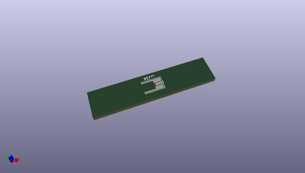
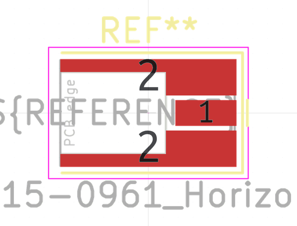
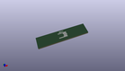

# OOMP Footprint  
## MMCX_Molex_73415-0961_Horizontal_1.6mm-PCB  by none  
  
oomp key: oomp_kicad_connector_coaxial_mmcx_molex_73415_0961_horizontal_1_6mm_pcb  
  
source repo at: [http://gitlab.com/kicad/kicad-footprints/blob/master/tmp/data//oomlout_oomp_footprint_src/Varistor.pretty/RV_Rect_V25S440P_L26.5mm_W8.2mm_P12.7mm.kicad_mod](http://gitlab.com/kicad/kicad-footprints/blob/master/tmp/data//oomlout_oomp_footprint_src/Varistor.pretty/RV_Rect_V25S440P_L26.5mm_W8.2mm_P12.7mm.kicad_mod)  
## Footprint  
  
  
  
  
| name | value | 
| --- | --- | 
| footprint name | MMCX_Molex_73415-0961_Horizontal_1.6mm-PCB | 
| footprint description | Molex MMCX Horizontal Coaxial https://www.molex.com/pdm_docs/sd/734150961_sd.pdf | 
| number of pads | 3 | 
| github path | http://github.com/kicad/kicad-footprints/blob/master/tmp/data//oomlout_oomp_footprint_src/Connector_Coaxial.pretty/MMCX_Molex_73415-0961_Horizontal_1.6mm-PCB.kicad_mod | 
| oomp key | oomp_kicad_connector_coaxial_mmcx_molex_73415_0961_horizontal_1_6mm_pcb | 
| oomp bot github | https://github.com/oomlout/oomlout_oomp_footprint_bot/tree/main/tmp/data//oomlout_oomp_footprint_src/footprints/kicad_connector_coaxial_mmcx_molex_73415_0961_horizontal_1_6mm_pcb/working | 
## Images  
  
  
  
  
  
  
  
  
