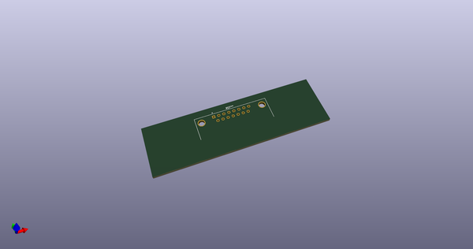
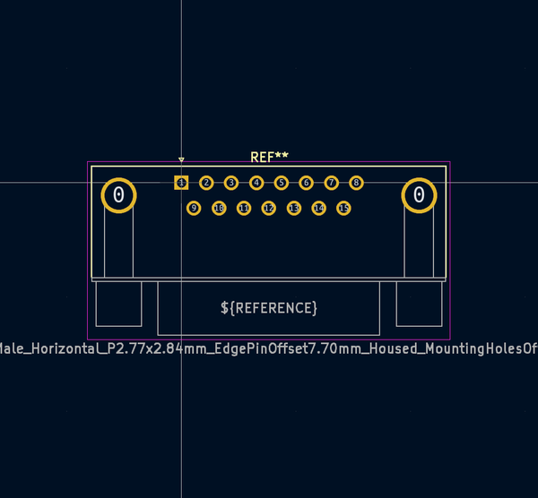
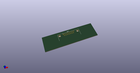
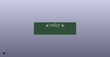

# OOMP Footprint  
## DSUB-15_Male_Horizontal_P2.77x2.84mm_EdgePinOffset7.70mm_Housed_MountingHolesOffset9.12mm  by none  
  
oomp key: oomp_kicad_connector_dsub_dsub_15_male_horizontal_p2_77x2_84mm_edgepinoffset7_70mm_housed_mountingholesoffset9_12mm  
  
source repo at: [http://gitlab.com/kicad/kicad-footprints/blob/master/tmp/data//oomlout_oomp_footprint_src/Varistor.pretty/RV_Rect_V25S440P_L26.5mm_W8.2mm_P12.7mm.kicad_mod](http://gitlab.com/kicad/kicad-footprints/blob/master/tmp/data//oomlout_oomp_footprint_src/Varistor.pretty/RV_Rect_V25S440P_L26.5mm_W8.2mm_P12.7mm.kicad_mod)  
## Footprint  
  
  
  
  
| name | value | 
| --- | --- | 
| footprint name | DSUB-15_Male_Horizontal_P2.77x2.84mm_EdgePinOffset7.70mm_Housed_MountingHolesOffset9.12mm | 
| footprint description | 15-pin D-Sub connector, horizontal/angled (90 deg), THT-mount, male, pitch 2.77x2.84mm, pin-PCB-offset 7.699999999999999mm, distance of mounting holes 33.3mm, distance of mounting holes to PCB edge 9.12mm, see https://disti-assets.s3.amazonaws.com/tonar/files/datasheets/16730.pdf | 
| number of pads | 17 | 
| github path | http://github.com/kicad/kicad-footprints/blob/master/tmp/data//oomlout_oomp_footprint_src/Connector_Dsub.pretty/DSUB-15_Male_Horizontal_P2.77x2.84mm_EdgePinOffset7.70mm_Housed_MountingHolesOffset9.12mm.kicad_mod | 
| oomp key | oomp_kicad_connector_dsub_dsub_15_male_horizontal_p2_77x2_84mm_edgepinoffset7_70mm_housed_mountingholesoffset9_12mm | 
| oomp bot github | https://github.com/oomlout/oomlout_oomp_footprint_bot/tree/main/tmp/data//oomlout_oomp_footprint_src/footprints/kicad_connector_dsub_dsub_15_male_horizontal_p2_77x2_84mm_edgepinoffset7_70mm_housed_mountingholesoffset9_12mm/working | 
## Images  
  
  
  
  
  
  
  
  
