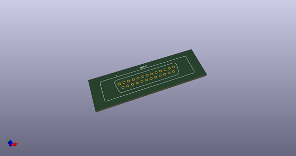
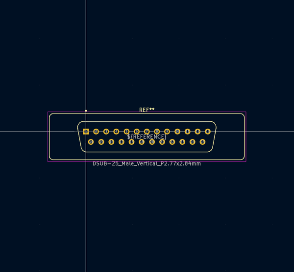
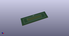
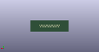
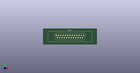

# OOMP Footprint  
## DSUB-25_Male_Vertical_P2.77x2.84mm  by none  
  
oomp key: oomp_kicad_connector_dsub_dsub_25_male_vertical_p2_77x2_84mm  
  
source repo at: [http://gitlab.com/kicad/kicad-footprints/blob/master/tmp/data//oomlout_oomp_footprint_src/Varistor.pretty/RV_Rect_V25S440P_L26.5mm_W8.2mm_P12.7mm.kicad_mod](http://gitlab.com/kicad/kicad-footprints/blob/master/tmp/data//oomlout_oomp_footprint_src/Varistor.pretty/RV_Rect_V25S440P_L26.5mm_W8.2mm_P12.7mm.kicad_mod)  
## Footprint  
  
  
  
  
| name | value | 
| --- | --- | 
| footprint name | DSUB-25_Male_Vertical_P2.77x2.84mm | 
| footprint description | 25-pin D-Sub connector, straight/vertical, THT-mount, male, pitch 2.77x2.84mm, distance of mounting holes 47.1mm, see https://disti-assets.s3.amazonaws.com/tonar/files/datasheets/16730.pdf | 
| number of pads | 25 | 
| github path | http://github.com/kicad/kicad-footprints/blob/master/tmp/data//oomlout_oomp_footprint_src/Connector_Dsub.pretty/DSUB-25_Male_Vertical_P2.77x2.84mm.kicad_mod | 
| oomp key | oomp_kicad_connector_dsub_dsub_25_male_vertical_p2_77x2_84mm | 
| oomp bot github | https://github.com/oomlout/oomlout_oomp_footprint_bot/tree/main/tmp/data//oomlout_oomp_footprint_src/footprints/kicad_connector_dsub_dsub_25_male_vertical_p2_77x2_84mm/working | 
## Images  
  
  
  
  
  
  
  
  
