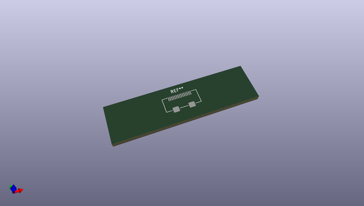
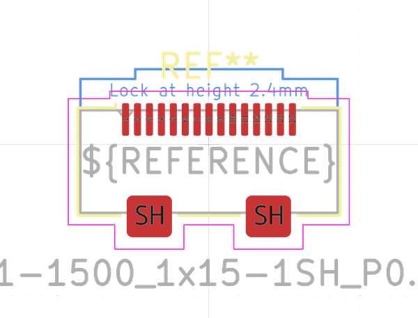
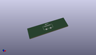

# OOMP Footprint  
## Molex_502231-1500_1x15-1SH_P0.5mm_Vertical  by none  
  
oomp key: oomp_kicad_connector_ffc_fpc_molex_502231_1500_1x15_1sh_p0_5mm_vertical  
  
source repo at: [http://gitlab.com/kicad/kicad-footprints/blob/master/tmp/data//oomlout_oomp_footprint_src/Varistor.pretty/RV_Rect_V25S440P_L26.5mm_W8.2mm_P12.7mm.kicad_mod](http://gitlab.com/kicad/kicad-footprints/blob/master/tmp/data//oomlout_oomp_footprint_src/Varistor.pretty/RV_Rect_V25S440P_L26.5mm_W8.2mm_P12.7mm.kicad_mod)  
## Footprint  
  
  
  
  
| name | value | 
| --- | --- | 
| footprint name | Molex_502231-1500_1x15-1SH_P0.5mm_Vertical | 
| footprint description | Molex 0.50mm Pitch Easy-On Type FFC/FPC Connector, For LVDS, 6.05mm Height, Vertical, Surface Mount, ZIF, 15 Circuits (https://www.molex.com/pdm_docs/sd/5022311500_sd.pdf) | 
| number of pads | 17 | 
| github path | http://github.com/kicad/kicad-footprints/blob/master/tmp/data//oomlout_oomp_footprint_src/Connector_FFC-FPC.pretty/Molex_502231-1500_1x15-1SH_P0.5mm_Vertical.kicad_mod | 
| oomp key | oomp_kicad_connector_ffc_fpc_molex_502231_1500_1x15_1sh_p0_5mm_vertical | 
| oomp bot github | https://github.com/oomlout/oomlout_oomp_footprint_bot/tree/main/tmp/data//oomlout_oomp_footprint_src/footprints/kicad_connector_ffc_fpc_molex_502231_1500_1x15_1sh_p0_5mm_vertical/working | 
## Images  
  
  
  
  
  
  
  
  
