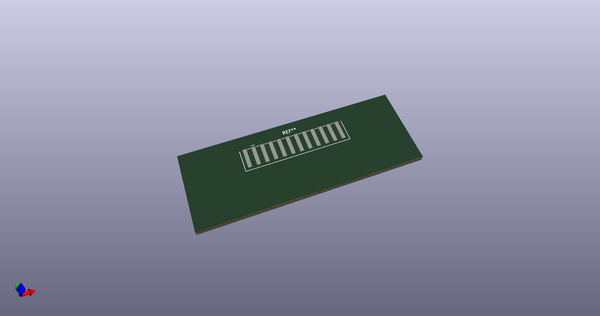
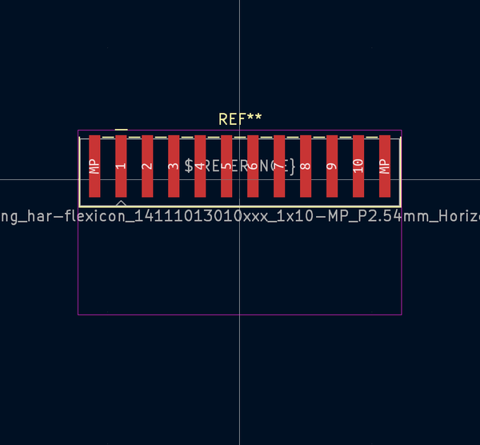
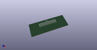
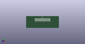

# OOMP Footprint  
## Harting_har-flexicon_14111013010xxx_1x10-MP_P2.54mm_Horizontal  by none  
  
oomp key: oomp_kicad_connector_harting_harting_har_flexicon_14111013010xxx_1x10_mp_p2_54mm_horizontal  
  
source repo at: [http://gitlab.com/kicad/kicad-footprints/blob/master/tmp/data//oomlout_oomp_footprint_src/Varistor.pretty/RV_Rect_V25S440P_L26.5mm_W8.2mm_P12.7mm.kicad_mod](http://gitlab.com/kicad/kicad-footprints/blob/master/tmp/data//oomlout_oomp_footprint_src/Varistor.pretty/RV_Rect_V25S440P_L26.5mm_W8.2mm_P12.7mm.kicad_mod)  
## Footprint  
  
  
  
  
| name | value | 
| --- | --- | 
| footprint name | Harting_har-flexicon_14111013010xxx_1x10-MP_P2.54mm_Horizontal | 
| footprint description | Harting har-flexicon series connector, 14111013010xxx (https://b2b.harting.com/files/download/PRD/PDF_TS/1411XX13010XXX_100228421DRW063C.pdf), generated with kicad-footprint-generator | 
| number of pads | 12 | 
| github path | http://github.com/kicad/kicad-footprints/blob/master/tmp/data//oomlout_oomp_footprint_src/Connector_Harting.pretty/Harting_har-flexicon_14111013010xxx_1x10-MP_P2.54mm_Horizontal.kicad_mod | 
| oomp key | oomp_kicad_connector_harting_harting_har_flexicon_14111013010xxx_1x10_mp_p2_54mm_horizontal | 
| oomp bot github | https://github.com/oomlout/oomlout_oomp_footprint_bot/tree/main/tmp/data//oomlout_oomp_footprint_src/footprints/kicad_connector_harting_harting_har_flexicon_14111013010xxx_1x10_mp_p2_54mm_horizontal/working | 
## Images  
  
  
  
  
  
  
  
  
