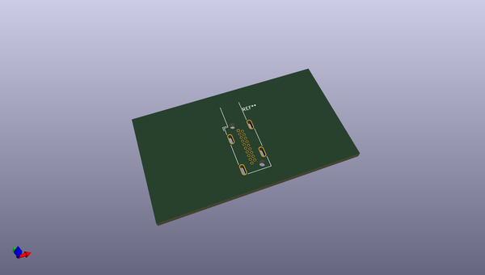
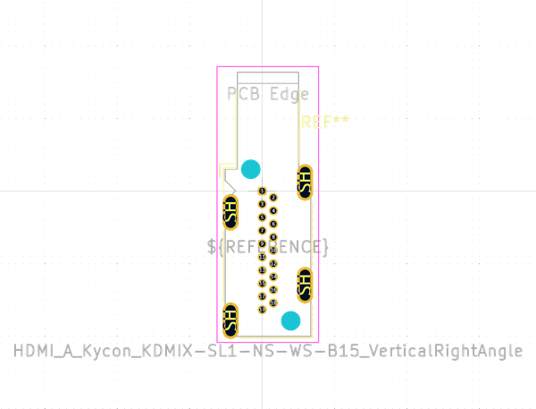
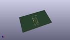
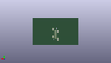
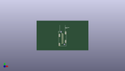

# OOMP Footprint  
## HDMI_A_Kycon_KDMIX-SL1-NS-WS-B15_VerticalRightAngle  by none  
  
oomp key: oomp_kicad_connector_hdmi_hdmi_a_kycon_kdmix_sl1_ns_ws_b15_verticalrightangle  
  
source repo at: [http://gitlab.com/kicad/kicad-footprints/blob/master/tmp/data//oomlout_oomp_footprint_src/Varistor.pretty/RV_Rect_V25S440P_L26.5mm_W8.2mm_P12.7mm.kicad_mod](http://gitlab.com/kicad/kicad-footprints/blob/master/tmp/data//oomlout_oomp_footprint_src/Varistor.pretty/RV_Rect_V25S440P_L26.5mm_W8.2mm_P12.7mm.kicad_mod)  
## Footprint  
  
  
  
  
| name | value | 
| --- | --- | 
| footprint name | HDMI_A_Kycon_KDMIX-SL1-NS-WS-B15_VerticalRightAngle | 
| footprint description | HDMI, Type A, Kycon KDMIX-SL1-NS-WS-B15, Vertical Right Angle, http://www.kycon.com/Pub_Eng_Draw/KDMIX-SL1-NS-WS-B15.pdf | 
| number of pads | 25 | 
| github path | http://github.com/kicad/kicad-footprints/blob/master/tmp/data//oomlout_oomp_footprint_src/Connector_HDMI.pretty/HDMI_A_Kycon_KDMIX-SL1-NS-WS-B15_VerticalRightAngle.kicad_mod | 
| oomp key | oomp_kicad_connector_hdmi_hdmi_a_kycon_kdmix_sl1_ns_ws_b15_verticalrightangle | 
| oomp bot github | https://github.com/oomlout/oomlout_oomp_footprint_bot/tree/main/tmp/data//oomlout_oomp_footprint_src/footprints/kicad_connector_hdmi_hdmi_a_kycon_kdmix_sl1_ns_ws_b15_verticalrightangle/working | 
## Images  
  
  
  
  
  
  
  
  
