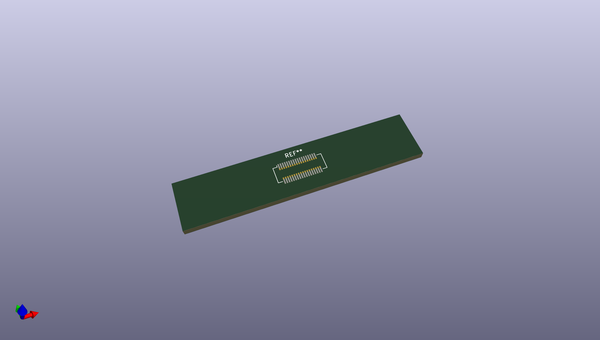
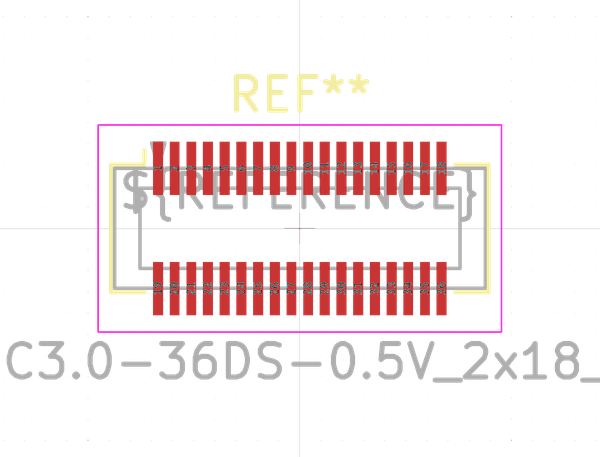
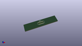

# OOMP Footprint  
## Hirose_DF12_DF12C3.0-36DS-0.5V_2x18_P0.50mm_Vertical  by none  
  
oomp key: oomp_kicad_connector_hirose_hirose_df12_df12c3_0_36ds_0_5v_2x18_p0_50mm_vertical  
  
source repo at: [http://gitlab.com/kicad/kicad-footprints/blob/master/tmp/data//oomlout_oomp_footprint_src/Varistor.pretty/RV_Rect_V25S440P_L26.5mm_W8.2mm_P12.7mm.kicad_mod](http://gitlab.com/kicad/kicad-footprints/blob/master/tmp/data//oomlout_oomp_footprint_src/Varistor.pretty/RV_Rect_V25S440P_L26.5mm_W8.2mm_P12.7mm.kicad_mod)  
## Footprint  
  
  
  
  
| name | value | 
| --- | --- | 
| footprint name | Hirose_DF12_DF12C3.0-36DS-0.5V_2x18_P0.50mm_Vertical | 
| footprint description | Hirose DF12C SMD, DF12C3.0-36DS-0.5V, 36 Pins per row (https://www.hirose.com/product/document?clcode=CL0537-0694-9-81&productname=DF12C(3.0)-50DS-0.5V(81)&series=DF12&documenttype=2DDrawing&lang=en&documentid=0000994748), generated with kicad-footprint-generator | 
| number of pads | 72 | 
| github path | http://github.com/kicad/kicad-footprints/blob/master/tmp/data//oomlout_oomp_footprint_src/Connector_Hirose.pretty/Hirose_DF12_DF12C3.0-36DS-0.5V_2x18_P0.50mm_Vertical.kicad_mod | 
| oomp key | oomp_kicad_connector_hirose_hirose_df12_df12c3_0_36ds_0_5v_2x18_p0_50mm_vertical | 
| oomp bot github | https://github.com/oomlout/oomlout_oomp_footprint_bot/tree/main/tmp/data//oomlout_oomp_footprint_src/footprints/kicad_connector_hirose_hirose_df12_df12c3_0_36ds_0_5v_2x18_p0_50mm_vertical/working | 
## Images  
  
  
  
  
  
  
  
  
