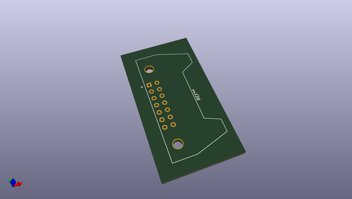
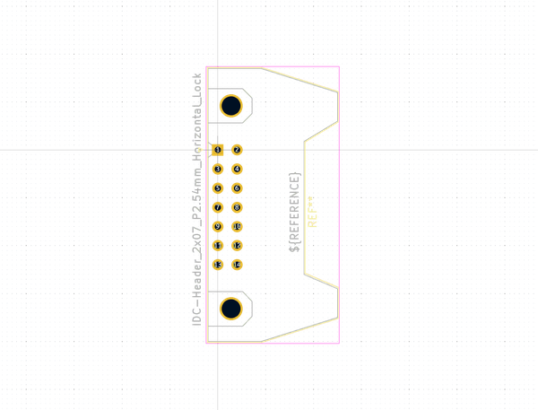
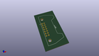
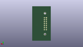
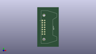

# OOMP Footprint  
## IDC-Header_2x07_P2.54mm_Horizontal_Lock  by none  
  
oomp key: oomp_kicad_connector_idc_idc_header_2x07_p2_54mm_horizontal_lock  
  
source repo at: [http://gitlab.com/kicad/kicad-footprints/blob/master/tmp/data//oomlout_oomp_footprint_src/Varistor.pretty/RV_Rect_V25S440P_L26.5mm_W8.2mm_P12.7mm.kicad_mod](http://gitlab.com/kicad/kicad-footprints/blob/master/tmp/data//oomlout_oomp_footprint_src/Varistor.pretty/RV_Rect_V25S440P_L26.5mm_W8.2mm_P12.7mm.kicad_mod)  
## Footprint  
  
  
  
  
| name | value | 
| --- | --- | 
| footprint name | IDC-Header_2x07_P2.54mm_Horizontal_Lock | 
| footprint description | Connector IDC Locked, 10 contacts, compatible header: PANCON HE10 (Series 50, (https://www.reboul.fr/storage/00003af6.pdf) | 
| number of pads | 16 | 
| github path | http://github.com/kicad/kicad-footprints/blob/master/tmp/data//oomlout_oomp_footprint_src/Connector_IDC.pretty/IDC-Header_2x07_P2.54mm_Horizontal_Lock.kicad_mod | 
| oomp key | oomp_kicad_connector_idc_idc_header_2x07_p2_54mm_horizontal_lock | 
| oomp bot github | https://github.com/oomlout/oomlout_oomp_footprint_bot/tree/main/tmp/data//oomlout_oomp_footprint_src/footprints/kicad_connector_idc_idc_header_2x07_p2_54mm_horizontal_lock/working | 
## Images  
  
  
  
  
  
  
  
  
