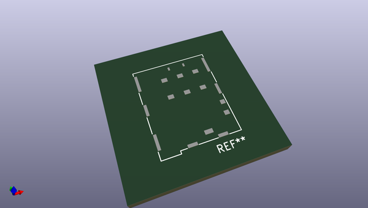
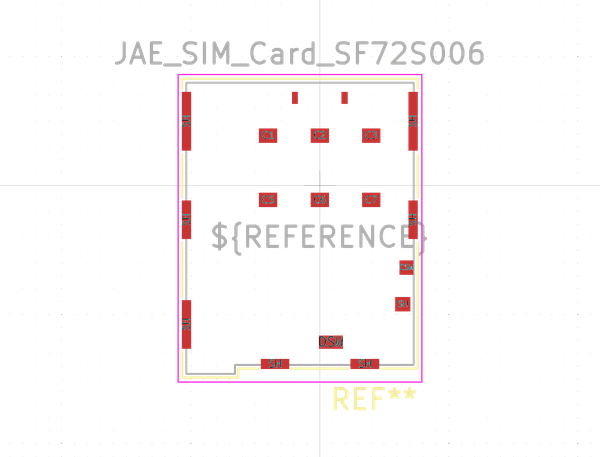

# OOMP Footprint  
## JAE_SIM_Card_SF72S006  by none  
  
oomp key: oomp_kicad_connector_jae_jae_sim_card_sf72s006  
  
source repo at: [http://gitlab.com/kicad/kicad-footprints/blob/master/tmp/data//oomlout_oomp_footprint_src/Varistor.pretty/RV_Rect_V25S440P_L26.5mm_W8.2mm_P12.7mm.kicad_mod](http://gitlab.com/kicad/kicad-footprints/blob/master/tmp/data//oomlout_oomp_footprint_src/Varistor.pretty/RV_Rect_V25S440P_L26.5mm_W8.2mm_P12.7mm.kicad_mod)  
## Footprint  
  
  
  
  
| name | value | 
| --- | --- | 
| footprint name | JAE_SIM_Card_SF72S006 | 
| footprint description | SIM Card, Push-Push, https://www.jae.com/direct/topics/topics_file_download/topics_id=68892&ext_no=06&index=0&_lang=en&v=202003111511468456809 | 
| number of pads | 18 | 
| github path | http://github.com/kicad/kicad-footprints/blob/master/tmp/data//oomlout_oomp_footprint_src/Connector_JAE.pretty/JAE_SIM_Card_SF72S006.kicad_mod | 
| oomp key | oomp_kicad_connector_jae_jae_sim_card_sf72s006 | 
| oomp bot github | https://github.com/oomlout/oomlout_oomp_footprint_bot/tree/main/tmp/data//oomlout_oomp_footprint_src/footprints/kicad_connector_jae_jae_sim_card_sf72s006/working | 
## Images  
  
  
  
  
  
  
  
  
