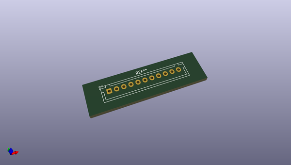
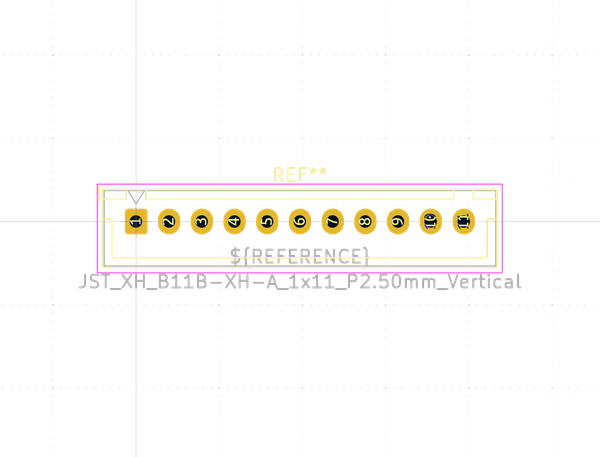
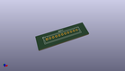

# OOMP Footprint  
## JST_XH_B11B-XH-A_1x11_P2.50mm_Vertical  by none  
  
oomp key: oomp_kicad_connector_jst_jst_xh_b11b_xh_a_1x11_p2_50mm_vertical  
  
source repo at: [http://gitlab.com/kicad/kicad-footprints/blob/master/tmp/data//oomlout_oomp_footprint_src/Varistor.pretty/RV_Rect_V25S440P_L26.5mm_W8.2mm_P12.7mm.kicad_mod](http://gitlab.com/kicad/kicad-footprints/blob/master/tmp/data//oomlout_oomp_footprint_src/Varistor.pretty/RV_Rect_V25S440P_L26.5mm_W8.2mm_P12.7mm.kicad_mod)  
## Footprint  
  
  
  
  
| name | value | 
| --- | --- | 
| footprint name | JST_XH_B11B-XH-A_1x11_P2.50mm_Vertical | 
| footprint description | JST XH series connector, B11B-XH-A (http://www.jst-mfg.com/product/pdf/eng/eXH.pdf), generated with kicad-footprint-generator | 
| number of pads | 11 | 
| github path | http://github.com/kicad/kicad-footprints/blob/master/tmp/data//oomlout_oomp_footprint_src/Connector_JST.pretty/JST_XH_B11B-XH-A_1x11_P2.50mm_Vertical.kicad_mod | 
| oomp key | oomp_kicad_connector_jst_jst_xh_b11b_xh_a_1x11_p2_50mm_vertical | 
| oomp bot github | https://github.com/oomlout/oomlout_oomp_footprint_bot/tree/main/tmp/data//oomlout_oomp_footprint_src/footprints/kicad_connector_jst_jst_xh_b11b_xh_a_1x11_p2_50mm_vertical/working | 
## Images  
  
  
  
  
  
  
  
  
