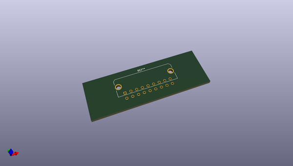
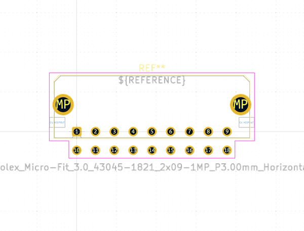
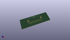
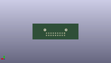
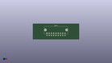

# OOMP Footprint  
## Molex_Micro-Fit_3.0_43045-1821_2x09-1MP_P3.00mm_Horizontal  by none  
  
oomp key: oomp_kicad_connector_molex_molex_micro_fit_3_0_43045_1821_2x09_1mp_p3_00mm_horizontal  
  
source repo at: [http://gitlab.com/kicad/kicad-footprints/blob/master/tmp/data//oomlout_oomp_footprint_src/Varistor.pretty/RV_Rect_V25S440P_L26.5mm_W8.2mm_P12.7mm.kicad_mod](http://gitlab.com/kicad/kicad-footprints/blob/master/tmp/data//oomlout_oomp_footprint_src/Varistor.pretty/RV_Rect_V25S440P_L26.5mm_W8.2mm_P12.7mm.kicad_mod)  
## Footprint  
  
  
  
  
| name | value | 
| --- | --- | 
| footprint name | Molex_Micro-Fit_3.0_43045-1821_2x09-1MP_P3.00mm_Horizontal | 
| footprint description | Molex Micro-Fit 3.0 Connector System, 43045-1821 (alternative finishes: 43045-182x), 9 Pins per row (https://www.molex.com/pdm_docs/sd/430450221_sd.pdf), generated with kicad-footprint-generator | 
| number of pads | 20 | 
| github path | http://github.com/kicad/kicad-footprints/blob/master/tmp/data//oomlout_oomp_footprint_src/Connector_Molex.pretty/Molex_Micro-Fit_3.0_43045-1821_2x09-1MP_P3.00mm_Horizontal.kicad_mod | 
| oomp key | oomp_kicad_connector_molex_molex_micro_fit_3_0_43045_1821_2x09_1mp_p3_00mm_horizontal | 
| oomp bot github | https://github.com/oomlout/oomlout_oomp_footprint_bot/tree/main/tmp/data//oomlout_oomp_footprint_src/footprints/kicad_connector_molex_molex_micro_fit_3_0_43045_1821_2x09_1mp_p3_00mm_horizontal/working | 
## Images  
  
  
  
  
  
  
  
  
