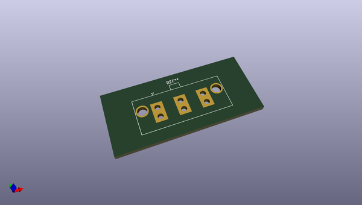
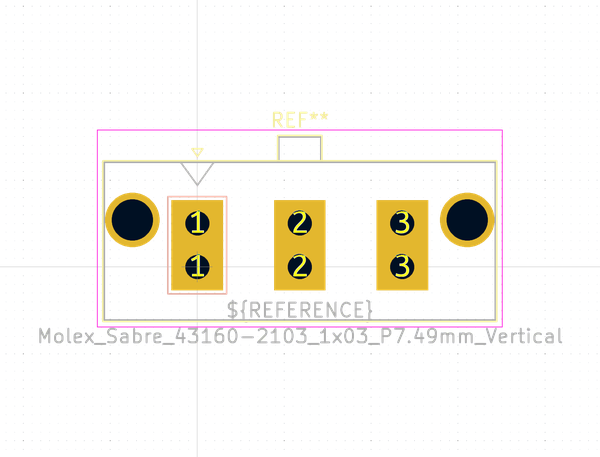
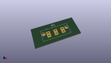
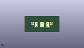
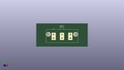

# OOMP Footprint  
## Molex_Sabre_43160-2103_1x03_P7.49mm_Vertical  by none  
  
oomp key: oomp_kicad_connector_molex_molex_sabre_43160_2103_1x03_p7_49mm_vertical  
  
source repo at: [http://gitlab.com/kicad/kicad-footprints/blob/master/tmp/data//oomlout_oomp_footprint_src/Varistor.pretty/RV_Rect_V25S440P_L26.5mm_W8.2mm_P12.7mm.kicad_mod](http://gitlab.com/kicad/kicad-footprints/blob/master/tmp/data//oomlout_oomp_footprint_src/Varistor.pretty/RV_Rect_V25S440P_L26.5mm_W8.2mm_P12.7mm.kicad_mod)  
## Footprint  
  
  
  
  
| name | value | 
| --- | --- | 
| footprint name | Molex_Sabre_43160-2103_1x03_P7.49mm_Vertical | 
| footprint description | Molex Sabre Power Connector, 43160-2103, 3 Pins per row (http://www.molex.com/pdm_docs/sd/431602102_sd.pdf), generated with kicad-footprint-generator | 
| number of pads | 8 | 
| github path | http://github.com/kicad/kicad-footprints/blob/master/tmp/data//oomlout_oomp_footprint_src/Connector_Molex.pretty/Molex_Sabre_43160-2103_1x03_P7.49mm_Vertical.kicad_mod | 
| oomp key | oomp_kicad_connector_molex_molex_sabre_43160_2103_1x03_p7_49mm_vertical | 
| oomp bot github | https://github.com/oomlout/oomlout_oomp_footprint_bot/tree/main/tmp/data//oomlout_oomp_footprint_src/footprints/kicad_connector_molex_molex_sabre_43160_2103_1x03_p7_49mm_vertical/working | 
## Images  
  
  
  
  
  
  
  
  
