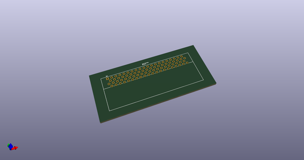
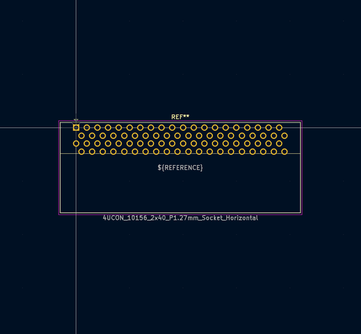
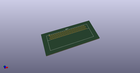
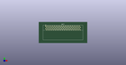

# OOMP Footprint  
## 4UCON_10156_2x40_P1.27mm_Socket_Horizontal  by none  
  
oomp key: oomp_kicad_connector_pcbedge_4ucon_10156_2x40_p1_27mm_socket_horizontal  
  
source repo at: [http://gitlab.com/kicad/kicad-footprints/blob/master/tmp/data//oomlout_oomp_footprint_src/Varistor.pretty/RV_Rect_V25S440P_L26.5mm_W8.2mm_P12.7mm.kicad_mod](http://gitlab.com/kicad/kicad-footprints/blob/master/tmp/data//oomlout_oomp_footprint_src/Varistor.pretty/RV_Rect_V25S440P_L26.5mm_W8.2mm_P12.7mm.kicad_mod)  
## Footprint  
  
  
  
  
| name | value | 
| --- | --- | 
| footprint name | 4UCON_10156_2x40_P1.27mm_Socket_Horizontal | 
| footprint description | 4UCON 10156 Card edge socket with 80 contacts (40 each side), through-hole, http://www.4uconnector.com/online/object/4udrawing/10156.pdf | 
| number of pads | 80 | 
| github path | http://github.com/kicad/kicad-footprints/blob/master/tmp/data//oomlout_oomp_footprint_src/Connector_PCBEdge.pretty/4UCON_10156_2x40_P1.27mm_Socket_Horizontal.kicad_mod | 
| oomp key | oomp_kicad_connector_pcbedge_4ucon_10156_2x40_p1_27mm_socket_horizontal | 
| oomp bot github | https://github.com/oomlout/oomlout_oomp_footprint_bot/tree/main/tmp/data//oomlout_oomp_footprint_src/footprints/kicad_connector_pcbedge_4ucon_10156_2x40_p1_27mm_socket_horizontal/working | 
## Images  
  
  
  
  
  
  
  
  
