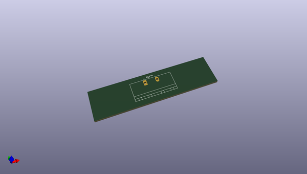
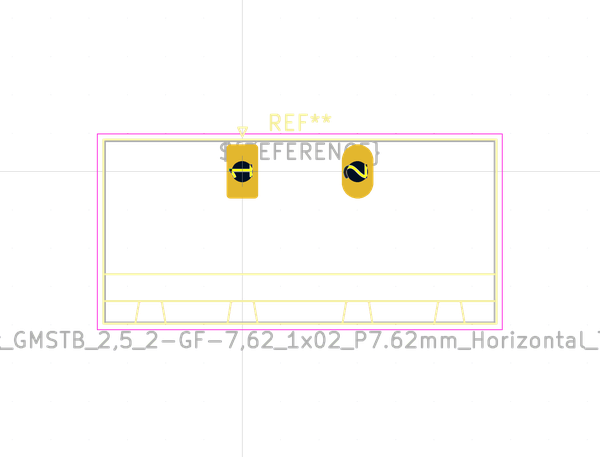

# OOMP Footprint  
## PhoenixContact_GMSTB_2,5_2-GF-7,62_1x02_P7.62mm_Horizontal_ThreadedFlange  by none  
  
oomp key: oomp_kicad_connector_phoenix_gmstb_phoenixcontact_gmstb_2,5_2_gf_7,62_1x02_p7_62mm_horizontal_threadedflange  
  
source repo at: [http://gitlab.com/kicad/kicad-footprints/blob/master/tmp/data//oomlout_oomp_footprint_src/Varistor.pretty/RV_Rect_V25S440P_L26.5mm_W8.2mm_P12.7mm.kicad_mod](http://gitlab.com/kicad/kicad-footprints/blob/master/tmp/data//oomlout_oomp_footprint_src/Varistor.pretty/RV_Rect_V25S440P_L26.5mm_W8.2mm_P12.7mm.kicad_mod)  
## Footprint  
  
  
  
  
| name | value | 
| --- | --- | 
| footprint name | PhoenixContact_GMSTB_2,5_2-GF-7,62_1x02_P7.62mm_Horizontal_ThreadedFlange | 
| footprint description | Generic Phoenix Contact connector footprint for: GMSTB_2,5/2-GF-7,62; number of pins: 02; pin pitch: 7.62mm; Angled; threaded flange || order number: 1806229 12A 630V | 
| number of pads | 2 | 
| github path | http://github.com/kicad/kicad-footprints/blob/master/tmp/data//oomlout_oomp_footprint_src/Connector_Phoenix_GMSTB.pretty/PhoenixContact_GMSTB_2,5_2-GF-7,62_1x02_P7.62mm_Horizontal_ThreadedFlange.kicad_mod | 
| oomp key | oomp_kicad_connector_phoenix_gmstb_phoenixcontact_gmstb_2,5_2_gf_7,62_1x02_p7_62mm_horizontal_threadedflange | 
| oomp bot github | https://github.com/oomlout/oomlout_oomp_footprint_bot/tree/main/tmp/data//oomlout_oomp_footprint_src/footprints/kicad_connector_phoenix_gmstb_phoenixcontact_gmstb_2,5_2_gf_7,62_1x02_p7_62mm_horizontal_threadedflange/working | 
## Images  
  
  
  
  
  
  
  
  
