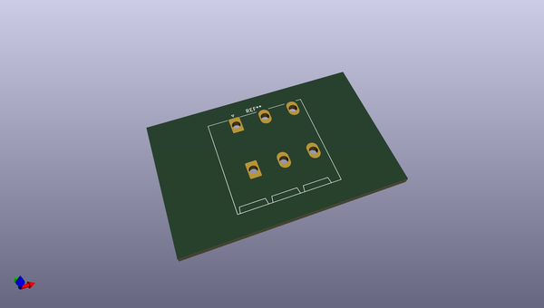
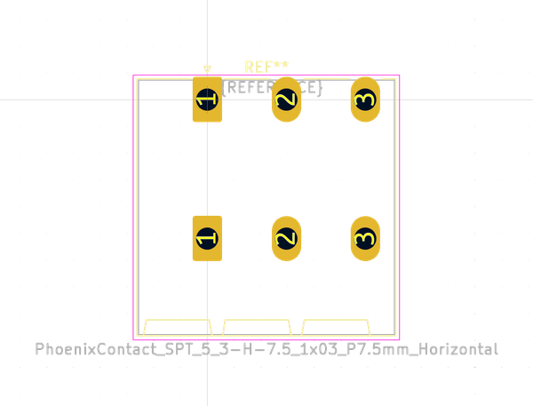
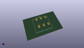
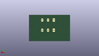
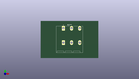

# OOMP Footprint  
## PhoenixContact_SPT_5_3-H-7.5_1x03_P7.5mm_Horizontal  by none  
  
oomp key: oomp_kicad_connector_phoenix_spt_phoenixcontact_spt_5_3_h_7_5_1x03_p7_5mm_horizontal  
  
source repo at: [http://gitlab.com/kicad/kicad-footprints/blob/master/tmp/data//oomlout_oomp_footprint_src/Varistor.pretty/RV_Rect_V25S440P_L26.5mm_W8.2mm_P12.7mm.kicad_mod](http://gitlab.com/kicad/kicad-footprints/blob/master/tmp/data//oomlout_oomp_footprint_src/Varistor.pretty/RV_Rect_V25S440P_L26.5mm_W8.2mm_P12.7mm.kicad_mod)  
## Footprint  
  
  
  
  
| name | value | 
| --- | --- | 
| footprint name | PhoenixContact_SPT_5_3-H-7.5_1x03_P7.5mm_Horizontal | 
| footprint description | Connector Phoenix Contact, SPT 5/3-H-7.5 Terminal Block, 1701361 (https://www.phoenixcontact.com/online/portal/gb/?uri=pxc-oc-itemdetail:pid=1701361), generated with kicad-footprint-generator | 
| number of pads | 6 | 
| github path | http://github.com/kicad/kicad-footprints/blob/master/tmp/data//oomlout_oomp_footprint_src/Connector_Phoenix_SPT.pretty/PhoenixContact_SPT_5_3-H-7.5_1x03_P7.5mm_Horizontal.kicad_mod | 
| oomp key | oomp_kicad_connector_phoenix_spt_phoenixcontact_spt_5_3_h_7_5_1x03_p7_5mm_horizontal | 
| oomp bot github | https://github.com/oomlout/oomlout_oomp_footprint_bot/tree/main/tmp/data//oomlout_oomp_footprint_src/footprints/kicad_connector_phoenix_spt_phoenixcontact_spt_5_3_h_7_5_1x03_p7_5mm_horizontal/working | 
## Images  
  
  
  
  
  
  
  
  
