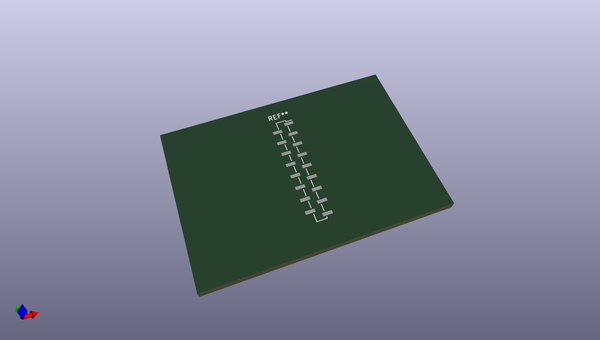
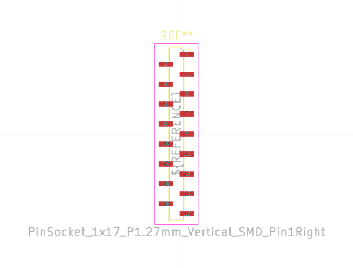
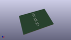
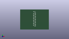

# OOMP Footprint  
## PinSocket_1x17_P1.27mm_Vertical_SMD_Pin1Right  by none  
  
oomp key: oomp_kicad_connector_pinsocket_1_27mm_pinsocket_1x17_p1_27mm_vertical_smd_pin1right  
  
source repo at: [http://gitlab.com/kicad/kicad-footprints/blob/master/tmp/data//oomlout_oomp_footprint_src/Varistor.pretty/RV_Rect_V25S440P_L26.5mm_W8.2mm_P12.7mm.kicad_mod](http://gitlab.com/kicad/kicad-footprints/blob/master/tmp/data//oomlout_oomp_footprint_src/Varistor.pretty/RV_Rect_V25S440P_L26.5mm_W8.2mm_P12.7mm.kicad_mod)  
## Footprint  
  
  
  
  
| name | value | 
| --- | --- | 
| footprint name | PinSocket_1x17_P1.27mm_Vertical_SMD_Pin1Right | 
| footprint description | surface-mounted straight socket strip, 1x17, 1.27mm pitch, single row, style 2 (pin 1 right) (https://gct.co/pdfjs/web/viewer.html?file=/Files/Drawings/BD075.pdf&t=1511594726925), script generated | 
| number of pads | 17 | 
| github path | http://github.com/kicad/kicad-footprints/blob/master/tmp/data//oomlout_oomp_footprint_src/Connector_PinSocket_1.27mm.pretty/PinSocket_1x17_P1.27mm_Vertical_SMD_Pin1Right.kicad_mod | 
| oomp key | oomp_kicad_connector_pinsocket_1_27mm_pinsocket_1x17_p1_27mm_vertical_smd_pin1right | 
| oomp bot github | https://github.com/oomlout/oomlout_oomp_footprint_bot/tree/main/tmp/data//oomlout_oomp_footprint_src/footprints/kicad_connector_pinsocket_1_27mm_pinsocket_1x17_p1_27mm_vertical_smd_pin1right/working | 
## Images  
  
  
  
  
  
  
  
  
