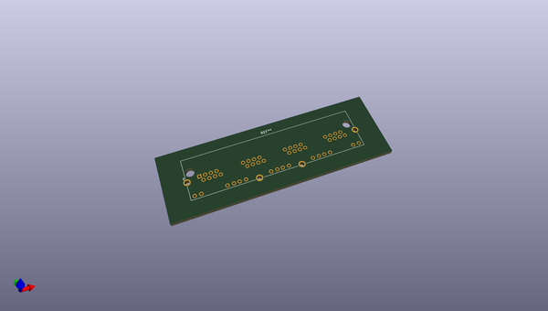
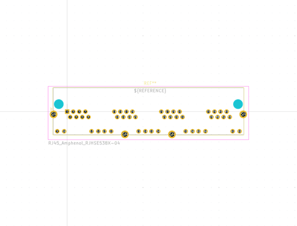
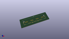

# OOMP Footprint  
## RJ45_Amphenol_RJHSE538X-04  by none  
  
oomp key: oomp_kicad_connector_rj_rj45_amphenol_rjhse538x_04  
  
source repo at: [http://gitlab.com/kicad/kicad-footprints/blob/master/tmp/data//oomlout_oomp_footprint_src/Varistor.pretty/RV_Rect_V25S440P_L26.5mm_W8.2mm_P12.7mm.kicad_mod](http://gitlab.com/kicad/kicad-footprints/blob/master/tmp/data//oomlout_oomp_footprint_src/Varistor.pretty/RV_Rect_V25S440P_L26.5mm_W8.2mm_P12.7mm.kicad_mod)  
## Footprint  
  
  
  
  
| name | value | 
| --- | --- | 
| footprint name | RJ45_Amphenol_RJHSE538X-04 | 
| footprint description | Shielded, LEDs, 4 Ports, https://cdn.amphenol-cs.com/media/wysiwyg/files/drawing/rjhse538x04.pdf | 
| number of pads | 54 | 
| github path | http://github.com/kicad/kicad-footprints/blob/master/tmp/data//oomlout_oomp_footprint_src/Connector_RJ.pretty/RJ45_Amphenol_RJHSE538X-04.kicad_mod | 
| oomp key | oomp_kicad_connector_rj_rj45_amphenol_rjhse538x_04 | 
| oomp bot github | https://github.com/oomlout/oomlout_oomp_footprint_bot/tree/main/tmp/data//oomlout_oomp_footprint_src/footprints/kicad_connector_rj_rj45_amphenol_rjhse538x_04/working | 
## Images  
  
  
  
  
  
  
  
  
