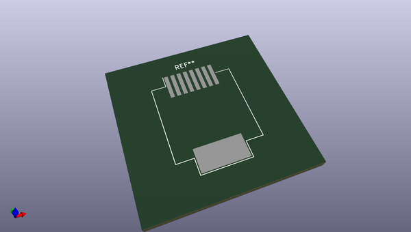
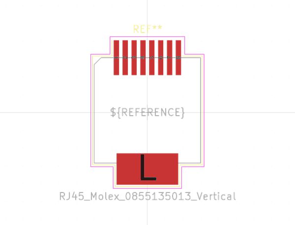

# OOMP Footprint  
## RJ45_Molex_0855135013_Vertical  by none  
  
oomp key: oomp_kicad_connector_rj_rj45_molex_0855135013_vertical  
  
source repo at: [http://gitlab.com/kicad/kicad-footprints/blob/master/tmp/data//oomlout_oomp_footprint_src/Varistor.pretty/RV_Rect_V25S440P_L26.5mm_W8.2mm_P12.7mm.kicad_mod](http://gitlab.com/kicad/kicad-footprints/blob/master/tmp/data//oomlout_oomp_footprint_src/Varistor.pretty/RV_Rect_V25S440P_L26.5mm_W8.2mm_P12.7mm.kicad_mod)  
## Footprint  
  
  
  
  
| name | value | 
| --- | --- | 
| footprint name | RJ45_Molex_0855135013_Vertical | 
| footprint description | 1 Port, RJ45, Series 85513, vertical, SMD, https://www.molex.com/pdm_docs/sd/855135013_sd.pdf | 
| number of pads | 9 | 
| github path | http://github.com/kicad/kicad-footprints/blob/master/tmp/data//oomlout_oomp_footprint_src/Connector_RJ.pretty/RJ45_Molex_0855135013_Vertical.kicad_mod | 
| oomp key | oomp_kicad_connector_rj_rj45_molex_0855135013_vertical | 
| oomp bot github | https://github.com/oomlout/oomlout_oomp_footprint_bot/tree/main/tmp/data//oomlout_oomp_footprint_src/footprints/kicad_connector_rj_rj45_molex_0855135013_vertical/working | 
## Images  
  
  
  
  
  
  
  
  
