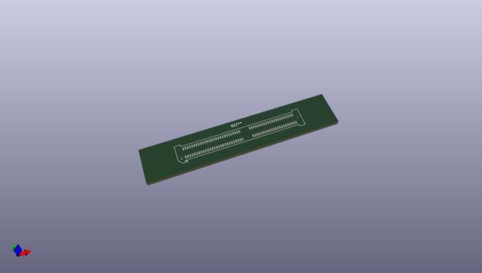
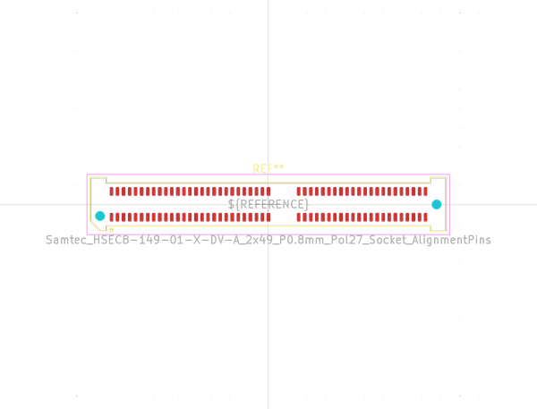
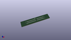

# OOMP Footprint  
## Samtec_HSEC8-149-01-X-DV-A_2x49_P0.8mm_Pol27_Socket_AlignmentPins  by none  
  
oomp key: oomp_kicad_connector_samtec_hsec8_samtec_hsec8_149_01_x_dv_a_2x49_p0_8mm_pol27_socket_alignmentpins  
  
source repo at: [http://gitlab.com/kicad/kicad-footprints/blob/master/tmp/data//oomlout_oomp_footprint_src/Varistor.pretty/RV_Rect_V25S440P_L26.5mm_W8.2mm_P12.7mm.kicad_mod](http://gitlab.com/kicad/kicad-footprints/blob/master/tmp/data//oomlout_oomp_footprint_src/Varistor.pretty/RV_Rect_V25S440P_L26.5mm_W8.2mm_P12.7mm.kicad_mod)  
## Footprint  
  
  
  
  
| name | value | 
| --- | --- | 
| footprint name | Samtec_HSEC8-149-01-X-DV-A_2x49_P0.8mm_Pol27_Socket_AlignmentPins | 
| footprint description | 0.8 mm Highspeed card edge card connector socket for 1.57mm PCBs, vertical, alignment pins (source: https://suddendocs.samtec.com/prints/hsec8-1xxx-xx-xx-dv-x-xx-footprint.pdf) | 
| number of pads | 100 | 
| github path | http://github.com/kicad/kicad-footprints/blob/master/tmp/data//oomlout_oomp_footprint_src/Connector_Samtec_HSEC8.pretty/Samtec_HSEC8-149-01-X-DV-A_2x49_P0.8mm_Pol27_Socket_AlignmentPins.kicad_mod | 
| oomp key | oomp_kicad_connector_samtec_hsec8_samtec_hsec8_149_01_x_dv_a_2x49_p0_8mm_pol27_socket_alignmentpins | 
| oomp bot github | https://github.com/oomlout/oomlout_oomp_footprint_bot/tree/main/tmp/data//oomlout_oomp_footprint_src/footprints/kicad_connector_samtec_hsec8_samtec_hsec8_149_01_x_dv_a_2x49_p0_8mm_pol27_socket_alignmentpins/working | 
## Images  
  
  
  
  
  
  
  
  
