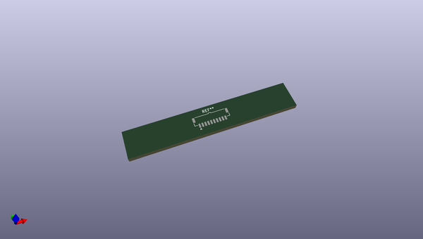
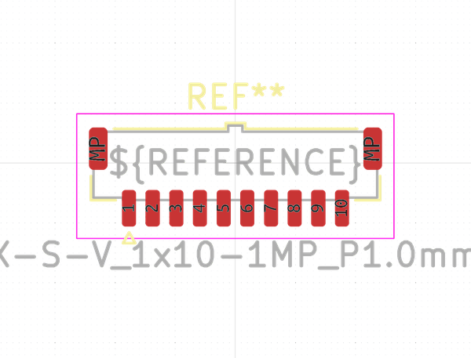
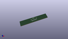

# OOMP Footprint  
## Samtec_T1M-10-X-S-V_1x10-1MP_P1.0mm_Terminal_Vertical  by none  
  
oomp key: oomp_kicad_connector_samtec_micromate_samtec_t1m_10_x_s_v_1x10_1mp_p1_0mm_terminal_vertical  
  
source repo at: [http://gitlab.com/kicad/kicad-footprints/blob/master/tmp/data//oomlout_oomp_footprint_src/Varistor.pretty/RV_Rect_V25S440P_L26.5mm_W8.2mm_P12.7mm.kicad_mod](http://gitlab.com/kicad/kicad-footprints/blob/master/tmp/data//oomlout_oomp_footprint_src/Varistor.pretty/RV_Rect_V25S440P_L26.5mm_W8.2mm_P12.7mm.kicad_mod)  
## Footprint  
  
  
  
  
| name | value | 
| --- | --- | 
| footprint name | Samtec_T1M-10-X-S-V_1x10-1MP_P1.0mm_Terminal_Vertical | 
| footprint description | Samtec Micro Mate Discrete Wire Terminal Strip, 1.00 mm Pitch, Single Row, Vertical (source: https://suddendocs.samtec.com/prints/t1m-single-row-footprint.pdf) | 
| number of pads | 12 | 
| github path | http://github.com/kicad/kicad-footprints/blob/master/tmp/data//oomlout_oomp_footprint_src/Connector_Samtec_MicroMate.pretty/Samtec_T1M-10-X-S-V_1x10-1MP_P1.0mm_Terminal_Vertical.kicad_mod | 
| oomp key | oomp_kicad_connector_samtec_micromate_samtec_t1m_10_x_s_v_1x10_1mp_p1_0mm_terminal_vertical | 
| oomp bot github | https://github.com/oomlout/oomlout_oomp_footprint_bot/tree/main/tmp/data//oomlout_oomp_footprint_src/footprints/kicad_connector_samtec_micromate_samtec_t1m_10_x_s_v_1x10_1mp_p1_0mm_terminal_vertical/working | 
## Images  
  
  
  
  
  
  
  
  
