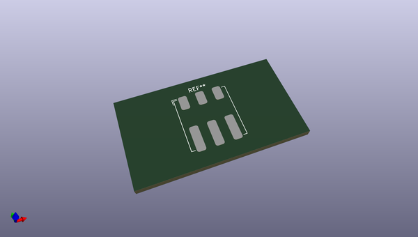
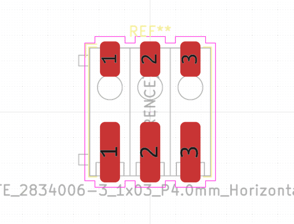
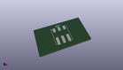

# OOMP Footprint  
## TE_2834006-3_1x03_P4.0mm_Horizontal  by none  
  
oomp key: oomp_kicad_connector_te_connectivity_te_2834006_3_1x03_p4_0mm_horizontal  
  
source repo at: [http://gitlab.com/kicad/kicad-footprints/blob/master/tmp/data//oomlout_oomp_footprint_src/Varistor.pretty/RV_Rect_V25S440P_L26.5mm_W8.2mm_P12.7mm.kicad_mod](http://gitlab.com/kicad/kicad-footprints/blob/master/tmp/data//oomlout_oomp_footprint_src/Varistor.pretty/RV_Rect_V25S440P_L26.5mm_W8.2mm_P12.7mm.kicad_mod)  
## Footprint  
  
  
  
  
| name | value | 
| --- | --- | 
| footprint name | TE_2834006-3_1x03_P4.0mm_Horizontal | 
| footprint description | TE Connectivity Buchanan WireMate connector, Poke-In series, 3-way, 4.0mm pitch, AWG18-22 (0.3255-0.823mm2), https://www.te.com/commerce/DocumentDelivery/DDEController?Action=showdoc&DocId=Customer+Drawing%7F2834006%7FB6%7Fpdf%7FEnglish%7FENG_CD_2834006_B6.pdf%7F2834006-1 | 
| number of pads | 6 | 
| github path | http://github.com/kicad/kicad-footprints/blob/master/tmp/data//oomlout_oomp_footprint_src/Connector_TE-Connectivity.pretty/TE_2834006-3_1x03_P4.0mm_Horizontal.kicad_mod | 
| oomp key | oomp_kicad_connector_te_connectivity_te_2834006_3_1x03_p4_0mm_horizontal | 
| oomp bot github | https://github.com/oomlout/oomlout_oomp_footprint_bot/tree/main/tmp/data//oomlout_oomp_footprint_src/footprints/kicad_connector_te_connectivity_te_2834006_3_1x03_p4_0mm_horizontal/working | 
## Images  
  
  
  
  
  
  
  
  
