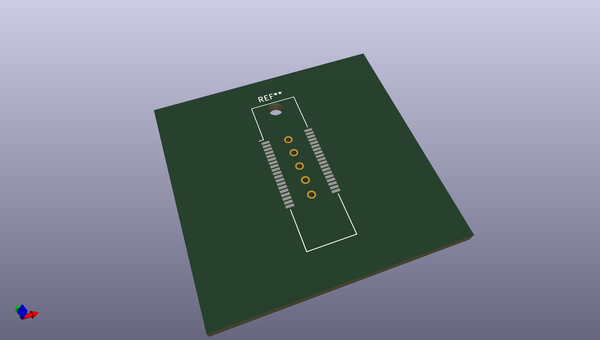
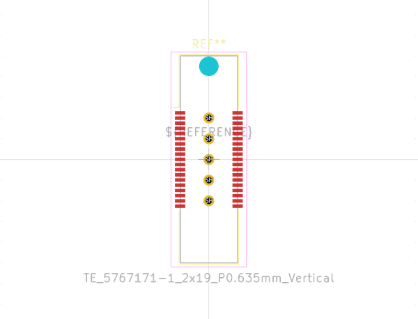
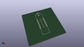
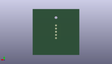

# OOMP Footprint  
## TE_5767171-1_2x19_P0.635mm_Vertical  by none  
  
oomp key: oomp_kicad_connector_te_connectivity_te_5767171_1_2x19_p0_635mm_vertical  
  
source repo at: [http://gitlab.com/kicad/kicad-footprints/blob/master/tmp/data//oomlout_oomp_footprint_src/Varistor.pretty/RV_Rect_V25S440P_L26.5mm_W8.2mm_P12.7mm.kicad_mod](http://gitlab.com/kicad/kicad-footprints/blob/master/tmp/data//oomlout_oomp_footprint_src/Varistor.pretty/RV_Rect_V25S440P_L26.5mm_W8.2mm_P12.7mm.kicad_mod)  
## Footprint  
  
  
  
  
| name | value | 
| --- | --- | 
| footprint name | TE_5767171-1_2x19_P0.635mm_Vertical | 
| footprint description | PCB Mount Receptacle, Vertical, Board-to-Board, 38 Position, 24.003mm / .64mm [.945in] Centerline, Header Only, Palladium Nickel (https://www.te.com/commerce/DocumentDelivery/DDEController?Action=showdoc&DocId=Customer+Drawing%7F5767171%7FB2%7Fpdf%7FEnglish%7FENG_CD_5767171_B2.pdf%7F5767171-1#page=2) | 
| number of pads | 44 | 
| github path | http://github.com/kicad/kicad-footprints/blob/master/tmp/data//oomlout_oomp_footprint_src/Connector_TE-Connectivity.pretty/TE_5767171-1_2x19_P0.635mm_Vertical.kicad_mod | 
| oomp key | oomp_kicad_connector_te_connectivity_te_5767171_1_2x19_p0_635mm_vertical | 
| oomp bot github | https://github.com/oomlout/oomlout_oomp_footprint_bot/tree/main/tmp/data//oomlout_oomp_footprint_src/footprints/kicad_connector_te_connectivity_te_5767171_1_2x19_p0_635mm_vertical/working | 
## Images  
  
  
  
  
  
  
  
  
