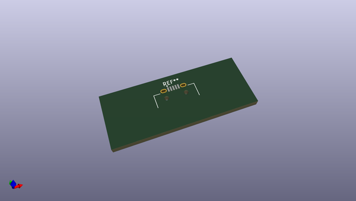
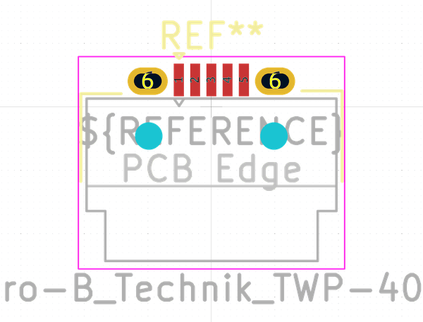
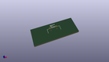

# OOMP Footprint  
## USB_Micro-B_Technik_TWP-4002D-H3  by none  
  
oomp key: oomp_kicad_connector_usb_usb_micro_b_technik_twp_4002d_h3  
  
source repo at: [http://gitlab.com/kicad/kicad-footprints/blob/master/tmp/data//oomlout_oomp_footprint_src/Varistor.pretty/RV_Rect_V25S440P_L26.5mm_W8.2mm_P12.7mm.kicad_mod](http://gitlab.com/kicad/kicad-footprints/blob/master/tmp/data//oomlout_oomp_footprint_src/Varistor.pretty/RV_Rect_V25S440P_L26.5mm_W8.2mm_P12.7mm.kicad_mod)  
## Footprint  
  
  
  
  
| name | value | 
| --- | --- | 
| footprint name | USB_Micro-B_Technik_TWP-4002D-H3 | 
| footprint description | Dustproof Micro USB Type B TWP-4002D-H3, https://www.technik.com.hk/images/pdf_product/WP4002D-H3-A_2.0.pdf | 
| number of pads | 9 | 
| github path | http://github.com/kicad/kicad-footprints/blob/master/tmp/data//oomlout_oomp_footprint_src/Connector_USB.pretty/USB_Micro-B_Technik_TWP-4002D-H3.kicad_mod | 
| oomp key | oomp_kicad_connector_usb_usb_micro_b_technik_twp_4002d_h3 | 
| oomp bot github | https://github.com/oomlout/oomlout_oomp_footprint_bot/tree/main/tmp/data//oomlout_oomp_footprint_src/footprints/kicad_connector_usb_usb_micro_b_technik_twp_4002d_h3/working | 
## Images  
  
  
  
  
  
  
  
  
