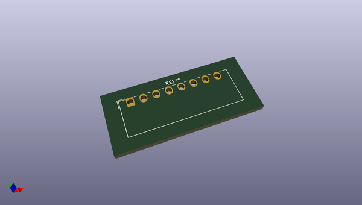
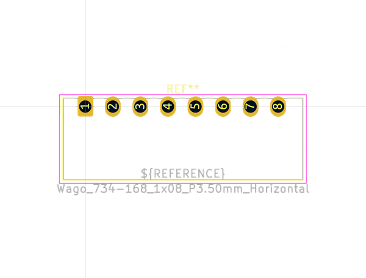
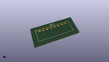
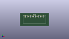

# OOMP Footprint  
## Wago_734-168_1x08_P3.50mm_Horizontal  by none  
  
oomp key: oomp_kicad_connector_wago_wago_734_168_1x08_p3_50mm_horizontal  
  
source repo at: [http://gitlab.com/kicad/kicad-footprints/blob/master/tmp/data//oomlout_oomp_footprint_src/Varistor.pretty/RV_Rect_V25S440P_L26.5mm_W8.2mm_P12.7mm.kicad_mod](http://gitlab.com/kicad/kicad-footprints/blob/master/tmp/data//oomlout_oomp_footprint_src/Varistor.pretty/RV_Rect_V25S440P_L26.5mm_W8.2mm_P12.7mm.kicad_mod)  
## Footprint  
  
  
  
  
| name | value | 
| --- | --- | 
| footprint name | Wago_734-168_1x08_P3.50mm_Horizontal | 
| footprint description | Molex 734 Male header (for PCBs); Angled solder pin 1 x 1 mm, 734-168 , 8 Pins (http://www.farnell.com/datasheets/2157639.pdf), generated with kicad-footprint-generator | 
| number of pads | 8 | 
| github path | http://github.com/kicad/kicad-footprints/blob/master/tmp/data//oomlout_oomp_footprint_src/Connector_Wago.pretty/Wago_734-168_1x08_P3.50mm_Horizontal.kicad_mod | 
| oomp key | oomp_kicad_connector_wago_wago_734_168_1x08_p3_50mm_horizontal | 
| oomp bot github | https://github.com/oomlout/oomlout_oomp_footprint_bot/tree/main/tmp/data//oomlout_oomp_footprint_src/footprints/kicad_connector_wago_wago_734_168_1x08_p3_50mm_horizontal/working | 
## Images  
  
  
  
  
  
  
  
  
