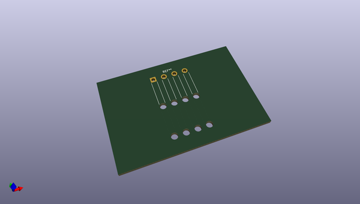
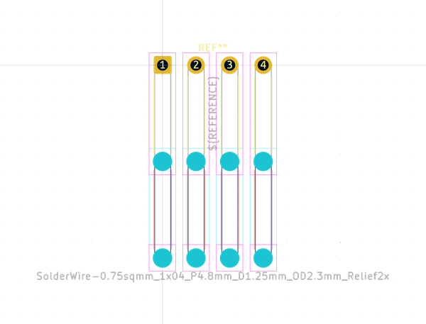
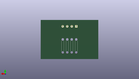
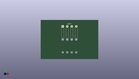

# OOMP Footprint  
## SolderWire-0.75sqmm_1x04_P4.8mm_D1.25mm_OD2.3mm_Relief2x  by none  
  
oomp key: oomp_kicad_connector_wire_solderwire_0_75sqmm_1x04_p4_8mm_d1_25mm_od2_3mm_relief2x  
  
source repo at: [http://gitlab.com/kicad/kicad-footprints/blob/master/tmp/data//oomlout_oomp_footprint_src/Varistor.pretty/RV_Rect_V25S440P_L26.5mm_W8.2mm_P12.7mm.kicad_mod](http://gitlab.com/kicad/kicad-footprints/blob/master/tmp/data//oomlout_oomp_footprint_src/Varistor.pretty/RV_Rect_V25S440P_L26.5mm_W8.2mm_P12.7mm.kicad_mod)  
## Footprint  
  
  
  
  
| name | value | 
| --- | --- | 
| footprint name | SolderWire-0.75sqmm_1x04_P4.8mm_D1.25mm_OD2.3mm_Relief2x | 
| footprint description | Soldered wire connection with double feed through strain relief, for 4 times 0.75 mm² wires, basic insulation, conductor diameter 1.25mm, outer diameter 2.3mm, size source Multi-Contact FLEXI-E 0.75 (https://ec.staubli.com/AcroFiles/Catalogues/TM_Cab-Main-11014119_(en)_hi.pdf), bend radius 3 times outer diameter, generated with kicad-footprint-generator | 
| number of pads | 12 | 
| github path | http://github.com/kicad/kicad-footprints/blob/master/tmp/data//oomlout_oomp_footprint_src/Connector_Wire.pretty/SolderWire-0.75sqmm_1x04_P4.8mm_D1.25mm_OD2.3mm_Relief2x.kicad_mod | 
| oomp key | oomp_kicad_connector_wire_solderwire_0_75sqmm_1x04_p4_8mm_d1_25mm_od2_3mm_relief2x | 
| oomp bot github | https://github.com/oomlout/oomlout_oomp_footprint_bot/tree/main/tmp/data//oomlout_oomp_footprint_src/footprints/kicad_connector_wire_solderwire_0_75sqmm_1x04_p4_8mm_d1_25mm_od2_3mm_relief2x/working | 
## Images  
  
  
  
  
  
  
  
  
