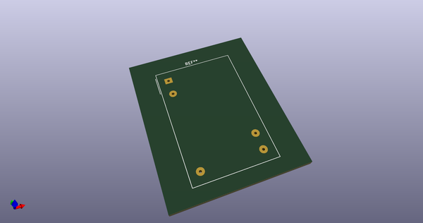
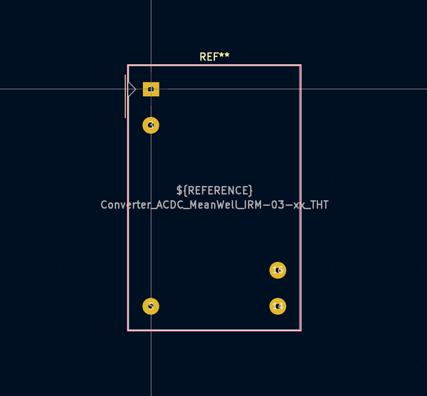
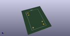

# OOMP Footprint  
## Converter_ACDC_MeanWell_IRM-03-xx_THT  by none  
  
oomp key: oomp_kicad_converter_acdc_converter_acdc_meanwell_irm_03_xx_tht  
  
source repo at: [http://gitlab.com/kicad/kicad-footprints/blob/master/tmp/data//oomlout_oomp_footprint_src/Varistor.pretty/RV_Rect_V25S440P_L26.5mm_W8.2mm_P12.7mm.kicad_mod](http://gitlab.com/kicad/kicad-footprints/blob/master/tmp/data//oomlout_oomp_footprint_src/Varistor.pretty/RV_Rect_V25S440P_L26.5mm_W8.2mm_P12.7mm.kicad_mod)  
## Footprint  
  
  
  
  
| name | value | 
| --- | --- | 
| footprint name | Converter_ACDC_MeanWell_IRM-03-xx_THT | 
| footprint description | ACDC-Converter, 3W, Meanwell, IRM-03, THT, https://www.meanwell.com/Upload/PDF/IRM-03/IRM-03-SPEC.PDF | 
| number of pads | 5 | 
| github path | http://github.com/kicad/kicad-footprints/blob/master/tmp/data//oomlout_oomp_footprint_src/Converter_ACDC.pretty/Converter_ACDC_MeanWell_IRM-03-xx_THT.kicad_mod | 
| oomp key | oomp_kicad_converter_acdc_converter_acdc_meanwell_irm_03_xx_tht | 
| oomp bot github | https://github.com/oomlout/oomlout_oomp_footprint_bot/tree/main/tmp/data//oomlout_oomp_footprint_src/footprints/kicad_converter_acdc_converter_acdc_meanwell_irm_03_xx_tht/working | 
## Images  
  
  
  
  
  
  
  
  
