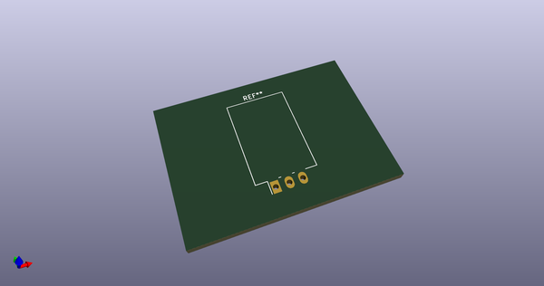
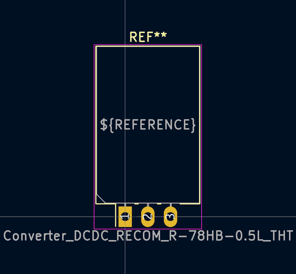
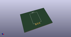

# OOMP Footprint  
## Converter_DCDC_RECOM_R-78HB-0.5L_THT  by none  
  
oomp key: oomp_kicad_converter_dcdc_converter_dcdc_recom_r_78hb_0_5l_tht  
  
source repo at: [http://gitlab.com/kicad/kicad-footprints/blob/master/tmp/data//oomlout_oomp_footprint_src/Varistor.pretty/RV_Rect_V25S440P_L26.5mm_W8.2mm_P12.7mm.kicad_mod](http://gitlab.com/kicad/kicad-footprints/blob/master/tmp/data//oomlout_oomp_footprint_src/Varistor.pretty/RV_Rect_V25S440P_L26.5mm_W8.2mm_P12.7mm.kicad_mod)  
## Footprint  
  
  
  
  
| name | value | 
| --- | --- | 
| footprint name | Converter_DCDC_RECOM_R-78HB-0.5L_THT | 
| footprint description | DCDC-Converter, RECOM, RECOM_R-78HB-0.5L, SIP-3, Horizontally Mounted, pitch 2.54mm, package size 11.5x8.5x17.5mm^3, https://www.recom-power.com/pdf/Innoline/R-78HBxx-0.5_L.pdf | 
| number of pads | 3 | 
| github path | http://github.com/kicad/kicad-footprints/blob/master/tmp/data//oomlout_oomp_footprint_src/Converter_DCDC.pretty/Converter_DCDC_RECOM_R-78HB-0.5L_THT.kicad_mod | 
| oomp key | oomp_kicad_converter_dcdc_converter_dcdc_recom_r_78hb_0_5l_tht | 
| oomp bot github | https://github.com/oomlout/oomlout_oomp_footprint_bot/tree/main/tmp/data//oomlout_oomp_footprint_src/footprints/kicad_converter_dcdc_converter_dcdc_recom_r_78hb_0_5l_tht/working | 
## Images  
  
  
  
  
  
  
  
  
