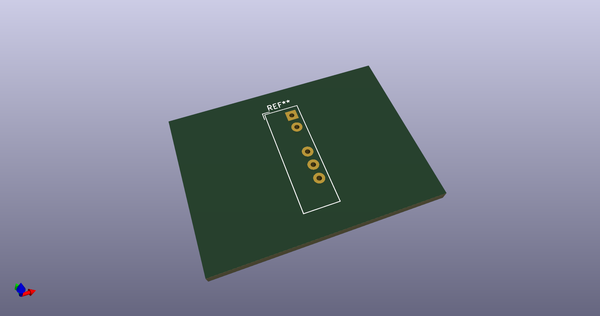
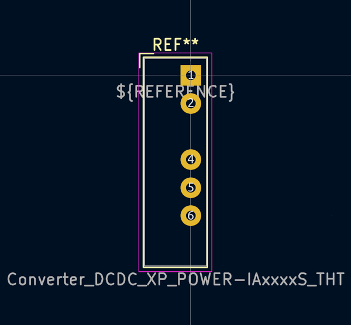

# OOMP Footprint  
## Converter_DCDC_XP_POWER-IAxxxxS_THT  by none  
  
oomp key: oomp_kicad_converter_dcdc_converter_dcdc_xp_power_iaxxxxs_tht  
  
source repo at: [http://gitlab.com/kicad/kicad-footprints/blob/master/tmp/data//oomlout_oomp_footprint_src/Varistor.pretty/RV_Rect_V25S440P_L26.5mm_W8.2mm_P12.7mm.kicad_mod](http://gitlab.com/kicad/kicad-footprints/blob/master/tmp/data//oomlout_oomp_footprint_src/Varistor.pretty/RV_Rect_V25S440P_L26.5mm_W8.2mm_P12.7mm.kicad_mod)  
## Footprint  
  
  
  
  
| name | value | 
| --- | --- | 
| footprint name | Converter_DCDC_XP_POWER-IAxxxxS_THT | 
| footprint description | XP_POWER  IAxxxxS, SIP, (https://www.xppower.com/pdfs/SF_IA.pdf), generated with kicad-footprint-generator | 
| number of pads | 5 | 
| github path | http://github.com/kicad/kicad-footprints/blob/master/tmp/data//oomlout_oomp_footprint_src/Converter_DCDC.pretty/Converter_DCDC_XP_POWER-IAxxxxS_THT.kicad_mod | 
| oomp key | oomp_kicad_converter_dcdc_converter_dcdc_xp_power_iaxxxxs_tht | 
| oomp bot github | https://github.com/oomlout/oomlout_oomp_footprint_bot/tree/main/tmp/data//oomlout_oomp_footprint_src/footprints/kicad_converter_dcdc_converter_dcdc_xp_power_iaxxxxs_tht/working | 
## Images  
  
  
  
  
  
  
  
  
