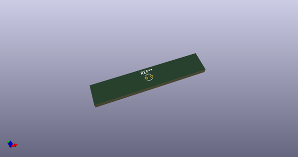
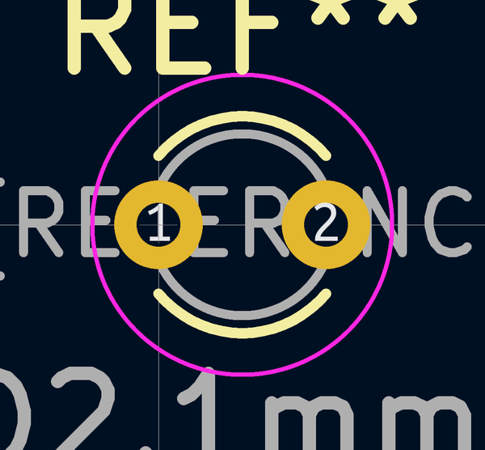
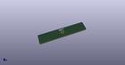

# OOMP Footprint  
## Crystal_C26-LF_D2.1mm_L6.5mm_Vertical  by none  
  
oomp key: oomp_kicad_crystal_crystal_c26_lf_d2_1mm_l6_5mm_vertical  
  
source repo at: [http://gitlab.com/kicad/kicad-footprints/blob/master/tmp/data//oomlout_oomp_footprint_src/Varistor.pretty/RV_Rect_V25S440P_L26.5mm_W8.2mm_P12.7mm.kicad_mod](http://gitlab.com/kicad/kicad-footprints/blob/master/tmp/data//oomlout_oomp_footprint_src/Varistor.pretty/RV_Rect_V25S440P_L26.5mm_W8.2mm_P12.7mm.kicad_mod)  
## Footprint  
  
  
  
  
| name | value | 
| --- | --- | 
| footprint name | Crystal_C26-LF_D2.1mm_L6.5mm_Vertical | 
| footprint description | Crystal THT C26-LF 6.5mm length 2.06mm diameter | 
| number of pads | 2 | 
| github path | http://github.com/kicad/kicad-footprints/blob/master/tmp/data//oomlout_oomp_footprint_src/Crystal.pretty/Crystal_C26-LF_D2.1mm_L6.5mm_Vertical.kicad_mod | 
| oomp key | oomp_kicad_crystal_crystal_c26_lf_d2_1mm_l6_5mm_vertical | 
| oomp bot github | https://github.com/oomlout/oomlout_oomp_footprint_bot/tree/main/tmp/data//oomlout_oomp_footprint_src/footprints/kicad_crystal_crystal_c26_lf_d2_1mm_l6_5mm_vertical/working | 
## Images  
  
  
  
  
  
  
  
  
