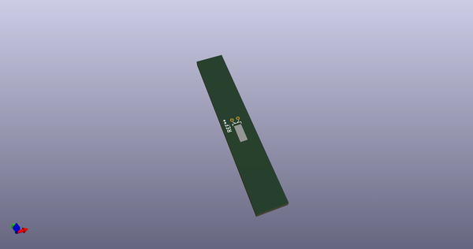
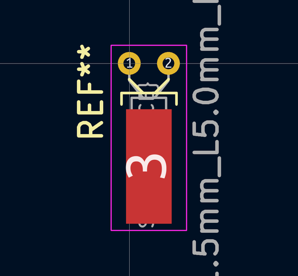

# OOMP Footprint  
## Crystal_DS15_D1.5mm_L5.0mm_Horizontal_1EP_style1  by none  
  
oomp key: oomp_kicad_crystal_crystal_ds15_d1_5mm_l5_0mm_horizontal_1ep_style1  
  
source repo at: [http://gitlab.com/kicad/kicad-footprints/blob/master/tmp/data//oomlout_oomp_footprint_src/Varistor.pretty/RV_Rect_V25S440P_L26.5mm_W8.2mm_P12.7mm.kicad_mod](http://gitlab.com/kicad/kicad-footprints/blob/master/tmp/data//oomlout_oomp_footprint_src/Varistor.pretty/RV_Rect_V25S440P_L26.5mm_W8.2mm_P12.7mm.kicad_mod)  
## Footprint  
  
  
  
  
| name | value | 
| --- | --- | 
| footprint name | Crystal_DS15_D1.5mm_L5.0mm_Horizontal_1EP_style1 | 
| footprint description | Crystal THT DS15 5.0mm length 1.5mm diameter http://www.microcrystal.com/images/_Product-Documentation/03_TF_metal_Packages/01_Datasheet/DS-Series.pdf | 
| number of pads | 3 | 
| github path | http://github.com/kicad/kicad-footprints/blob/master/tmp/data//oomlout_oomp_footprint_src/Crystal.pretty/Crystal_DS15_D1.5mm_L5.0mm_Horizontal_1EP_style1.kicad_mod | 
| oomp key | oomp_kicad_crystal_crystal_ds15_d1_5mm_l5_0mm_horizontal_1ep_style1 | 
| oomp bot github | https://github.com/oomlout/oomlout_oomp_footprint_bot/tree/main/tmp/data//oomlout_oomp_footprint_src/footprints/kicad_crystal_crystal_ds15_d1_5mm_l5_0mm_horizontal_1ep_style1/working | 
## Images  
  
  
  
  
  
  
  
  
