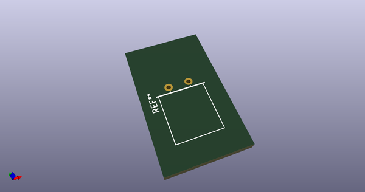
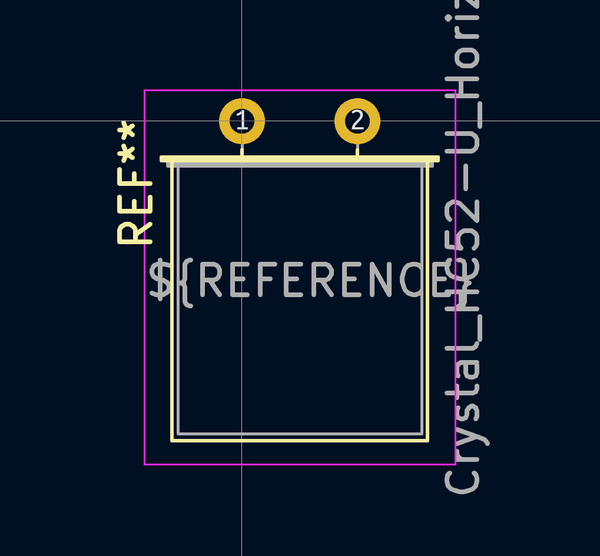
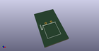
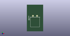

# OOMP Footprint  
## Crystal_HC52-U_Horizontal  by none  
  
oomp key: oomp_kicad_crystal_crystal_hc52_u_horizontal  
  
source repo at: [http://gitlab.com/kicad/kicad-footprints/blob/master/tmp/data//oomlout_oomp_footprint_src/Varistor.pretty/RV_Rect_V25S440P_L26.5mm_W8.2mm_P12.7mm.kicad_mod](http://gitlab.com/kicad/kicad-footprints/blob/master/tmp/data//oomlout_oomp_footprint_src/Varistor.pretty/RV_Rect_V25S440P_L26.5mm_W8.2mm_P12.7mm.kicad_mod)  
## Footprint  
  
  
  
  
| name | value | 
| --- | --- | 
| footprint name | Crystal_HC52-U_Horizontal | 
| footprint description | Crystal THT HC-51/U http://www.kvg-gmbh.de/assets/uploads/files/product_pdfs/XS71xx.pdf | 
| number of pads | 2 | 
| github path | http://github.com/kicad/kicad-footprints/blob/master/tmp/data//oomlout_oomp_footprint_src/Crystal.pretty/Crystal_HC52-U_Horizontal.kicad_mod | 
| oomp key | oomp_kicad_crystal_crystal_hc52_u_horizontal | 
| oomp bot github | https://github.com/oomlout/oomlout_oomp_footprint_bot/tree/main/tmp/data//oomlout_oomp_footprint_src/footprints/kicad_crystal_crystal_hc52_u_horizontal/working | 
## Images  
  
  
  
  
  
  
  
  
