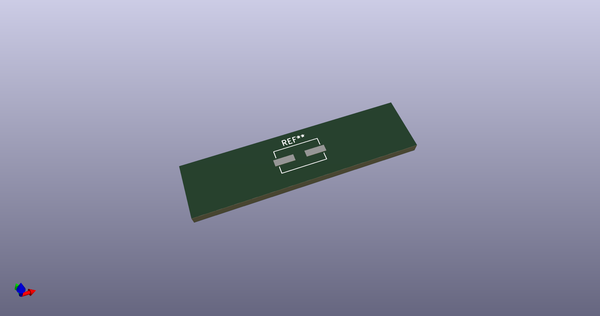
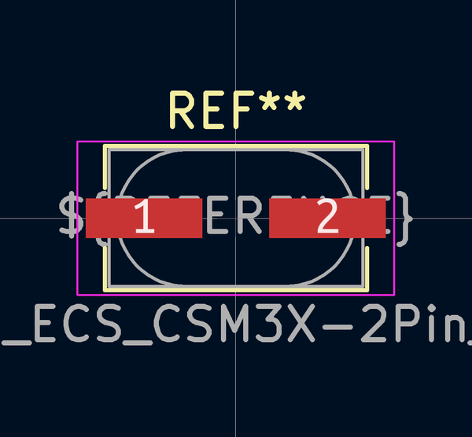
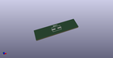
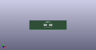

# OOMP Footprint  
## Crystal_SMD_ECS_CSM3X-2Pin_7.6x4.1mm  by none  
  
oomp key: oomp_kicad_crystal_crystal_smd_ecs_csm3x_2pin_7_6x4_1mm  
  
source repo at: [http://gitlab.com/kicad/kicad-footprints/blob/master/tmp/data//oomlout_oomp_footprint_src/Varistor.pretty/RV_Rect_V25S440P_L26.5mm_W8.2mm_P12.7mm.kicad_mod](http://gitlab.com/kicad/kicad-footprints/blob/master/tmp/data//oomlout_oomp_footprint_src/Varistor.pretty/RV_Rect_V25S440P_L26.5mm_W8.2mm_P12.7mm.kicad_mod)  
## Footprint  
  
  
  
  
| name | value | 
| --- | --- | 
| footprint name | Crystal_SMD_ECS_CSM3X-2Pin_7.6x4.1mm | 
| footprint description | http://www.ecsxtal.com/store/pdf/CSM-3X.pdf | 
| number of pads | 2 | 
| github path | http://github.com/kicad/kicad-footprints/blob/master/tmp/data//oomlout_oomp_footprint_src/Crystal.pretty/Crystal_SMD_ECS_CSM3X-2Pin_7.6x4.1mm.kicad_mod | 
| oomp key | oomp_kicad_crystal_crystal_smd_ecs_csm3x_2pin_7_6x4_1mm | 
| oomp bot github | https://github.com/oomlout/oomlout_oomp_footprint_bot/tree/main/tmp/data//oomlout_oomp_footprint_src/footprints/kicad_crystal_crystal_smd_ecs_csm3x_2pin_7_6x4_1mm/working | 
## Images  
  
  
  
  
  
  
  
  
