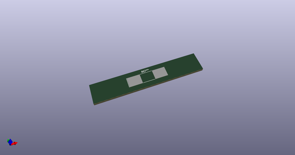
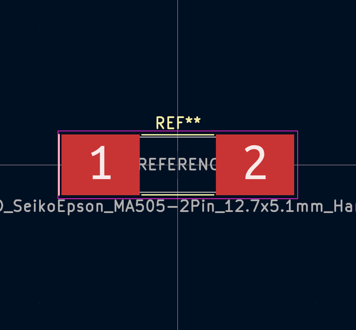
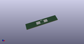

# OOMP Footprint  
## Crystal_SMD_SeikoEpson_MA505-2Pin_12.7x5.1mm_HandSoldering  by none  
  
oomp key: oomp_kicad_crystal_crystal_smd_seikoepson_ma505_2pin_12_7x5_1mm_handsoldering  
  
source repo at: [http://gitlab.com/kicad/kicad-footprints/blob/master/tmp/data//oomlout_oomp_footprint_src/Varistor.pretty/RV_Rect_V25S440P_L26.5mm_W8.2mm_P12.7mm.kicad_mod](http://gitlab.com/kicad/kicad-footprints/blob/master/tmp/data//oomlout_oomp_footprint_src/Varistor.pretty/RV_Rect_V25S440P_L26.5mm_W8.2mm_P12.7mm.kicad_mod)  
## Footprint  
  
  
  
  
| name | value | 
| --- | --- | 
| footprint name | Crystal_SMD_SeikoEpson_MA505-2Pin_12.7x5.1mm_HandSoldering | 
| footprint description | SMD Crystal Seiko Epson MC-505 http://media.digikey.com/pdf/Data%20Sheets/Epson%20PDFs/MA-505,506.pdf, hand-soldering, 12.7x5.1mm^2 package | 
| number of pads | 2 | 
| github path | http://github.com/kicad/kicad-footprints/blob/master/tmp/data//oomlout_oomp_footprint_src/Crystal.pretty/Crystal_SMD_SeikoEpson_MA505-2Pin_12.7x5.1mm_HandSoldering.kicad_mod | 
| oomp key | oomp_kicad_crystal_crystal_smd_seikoepson_ma505_2pin_12_7x5_1mm_handsoldering | 
| oomp bot github | https://github.com/oomlout/oomlout_oomp_footprint_bot/tree/main/tmp/data//oomlout_oomp_footprint_src/footprints/kicad_crystal_crystal_smd_seikoepson_ma505_2pin_12_7x5_1mm_handsoldering/working | 
## Images  
  
  
  
  
  
  
  
  
