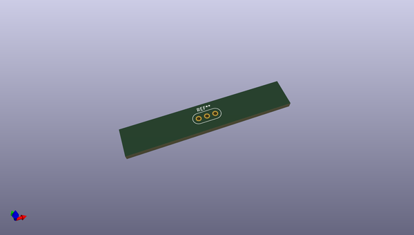
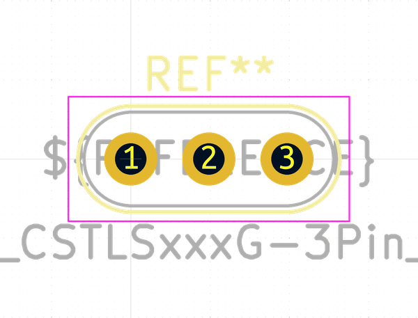
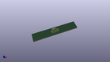
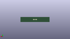
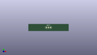

# OOMP Footprint  
## Resonator_Murata_CSTLSxxxG-3Pin_W8.0mm_H3.0mm  by none  
  
oomp key: oomp_kicad_crystal_resonator_murata_cstlsxxxg_3pin_w8_0mm_h3_0mm  
  
source repo at: [http://gitlab.com/kicad/kicad-footprints/blob/master/tmp/data//oomlout_oomp_footprint_src/Varistor.pretty/RV_Rect_V25S440P_L26.5mm_W8.2mm_P12.7mm.kicad_mod](http://gitlab.com/kicad/kicad-footprints/blob/master/tmp/data//oomlout_oomp_footprint_src/Varistor.pretty/RV_Rect_V25S440P_L26.5mm_W8.2mm_P12.7mm.kicad_mod)  
## Footprint  
  
  
  
  
| name | value | 
| --- | --- | 
| footprint name | Resonator_Murata_CSTLSxxxG-3Pin_W8.0mm_H3.0mm | 
| footprint description | Ceramic Resomator/Filter Murata CSTLSxxxG, http://www.murata.com/~/media/webrenewal/support/library/catalog/products/timingdevice/ceralock/p17e.ashx, length*width=8.0x3.0mm^2 package, package length=8.0mm, package width=3.0mm, 3 pins | 
| number of pads | 3 | 
| github path | http://github.com/kicad/kicad-footprints/blob/master/tmp/data//oomlout_oomp_footprint_src/Crystal.pretty/Resonator_Murata_CSTLSxxxG-3Pin_W8.0mm_H3.0mm.kicad_mod | 
| oomp key | oomp_kicad_crystal_resonator_murata_cstlsxxxg_3pin_w8_0mm_h3_0mm | 
| oomp bot github | https://github.com/oomlout/oomlout_oomp_footprint_bot/tree/main/tmp/data//oomlout_oomp_footprint_src/footprints/kicad_crystal_resonator_murata_cstlsxxxg_3pin_w8_0mm_h3_0mm/working | 
## Images  
  
  
  
  
  
  
  
  
