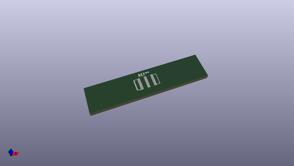
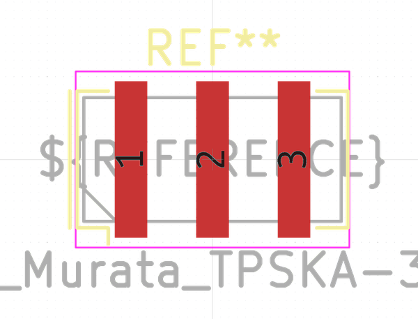
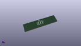
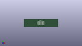

# OOMP Footprint  
## Resonator_SMD_Murata_TPSKA-3Pin_7.9x3.8mm  by none  
  
oomp key: oomp_kicad_crystal_resonator_smd_murata_tpska_3pin_7_9x3_8mm  
  
source repo at: [http://gitlab.com/kicad/kicad-footprints/blob/master/tmp/data//oomlout_oomp_footprint_src/Varistor.pretty/RV_Rect_V25S440P_L26.5mm_W8.2mm_P12.7mm.kicad_mod](http://gitlab.com/kicad/kicad-footprints/blob/master/tmp/data//oomlout_oomp_footprint_src/Varistor.pretty/RV_Rect_V25S440P_L26.5mm_W8.2mm_P12.7mm.kicad_mod)  
## Footprint  
  
  
  
  
| name | value | 
| --- | --- | 
| footprint name | Resonator_SMD_Murata_TPSKA-3Pin_7.9x3.8mm | 
| footprint description | SMD Resomator/Filter Murata TPSKA, http://cdn-reichelt.de/documents/datenblatt/B400/SFECV-107.pdf, 7.9x3.8mm^2 package | 
| number of pads | 3 | 
| github path | http://github.com/kicad/kicad-footprints/blob/master/tmp/data//oomlout_oomp_footprint_src/Crystal.pretty/Resonator_SMD_Murata_TPSKA-3Pin_7.9x3.8mm.kicad_mod | 
| oomp key | oomp_kicad_crystal_resonator_smd_murata_tpska_3pin_7_9x3_8mm | 
| oomp bot github | https://github.com/oomlout/oomlout_oomp_footprint_bot/tree/main/tmp/data//oomlout_oomp_footprint_src/footprints/kicad_crystal_resonator_smd_murata_tpska_3pin_7_9x3_8mm/working | 
## Images  
  
  
  
  
  
  
  
  
