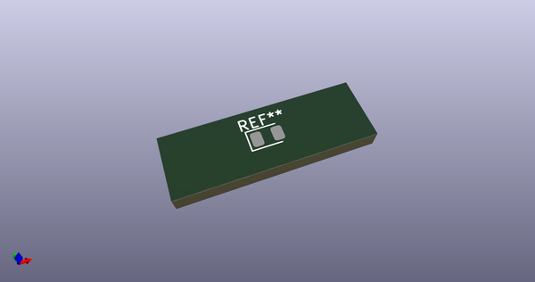
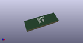

# OOMP Footprint  
## D_0805_2012Metric  by none  
  
oomp key: oomp_kicad_diode_smd_d_0805_2012metric  
  
source repo at: [http://gitlab.com/kicad/kicad-footprints/blob/master/tmp/data//oomlout_oomp_footprint_src/Varistor.pretty/RV_Rect_V25S440P_L26.5mm_W8.2mm_P12.7mm.kicad_mod](http://gitlab.com/kicad/kicad-footprints/blob/master/tmp/data//oomlout_oomp_footprint_src/Varistor.pretty/RV_Rect_V25S440P_L26.5mm_W8.2mm_P12.7mm.kicad_mod)  
## Footprint  
  
  
  
  
| name | value | 
| --- | --- | 
| footprint name | D_0805_2012Metric | 
| footprint description | Diode SMD 0805 (2012 Metric), square (rectangular) end terminal, IPC_7351 nominal, (Body size source: https://docs.google.com/spreadsheets/d/1BsfQQcO9C6DZCsRaXUlFlo91Tg2WpOkGARC1WS5S8t0/edit?usp=sharing), generated with kicad-footprint-generator | 
| number of pads | 2 | 
| github path | http://github.com/kicad/kicad-footprints/blob/master/tmp/data//oomlout_oomp_footprint_src/Diode_SMD.pretty/D_0805_2012Metric.kicad_mod | 
| oomp key | oomp_kicad_diode_smd_d_0805_2012metric | 
| oomp bot github | https://github.com/oomlout/oomlout_oomp_footprint_bot/tree/main/tmp/data//oomlout_oomp_footprint_src/footprints/kicad_diode_smd_d_0805_2012metric/working | 
## Images  
  
  
  
  
  
  
