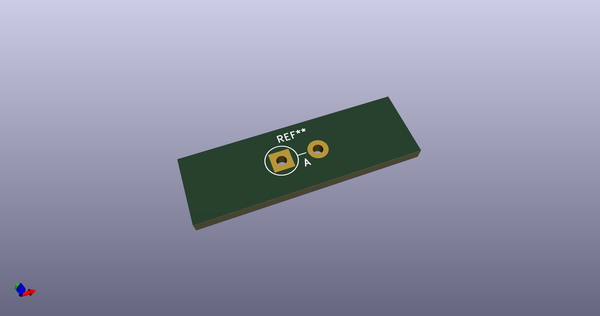
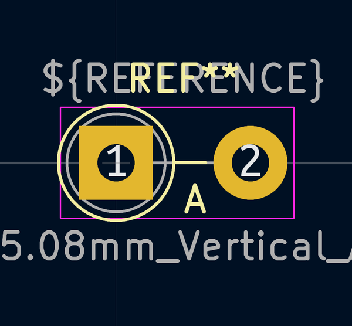
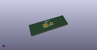

# OOMP Footprint  
## D_5W_P5.08mm_Vertical_AnodeUp  by none  
  
oomp key: oomp_kicad_diode_tht_d_5w_p5_08mm_vertical_anodeup  
  
source repo at: [http://gitlab.com/kicad/kicad-footprints/blob/master/tmp/data//oomlout_oomp_footprint_src/Varistor.pretty/RV_Rect_V25S440P_L26.5mm_W8.2mm_P12.7mm.kicad_mod](http://gitlab.com/kicad/kicad-footprints/blob/master/tmp/data//oomlout_oomp_footprint_src/Varistor.pretty/RV_Rect_V25S440P_L26.5mm_W8.2mm_P12.7mm.kicad_mod)  
## Footprint  
  
  
  
  
| name | value | 
| --- | --- | 
| footprint name | D_5W_P5.08mm_Vertical_AnodeUp | 
| footprint description | Diode, 5W series, Axial, Vertical, pin pitch=5.08mm, , length*diameter=8.9*3.7mm^2, , http://www.diodes.com/_files/packages/8686949.gif | 
| number of pads | 2 | 
| github path | http://github.com/kicad/kicad-footprints/blob/master/tmp/data//oomlout_oomp_footprint_src/Diode_THT.pretty/D_5W_P5.08mm_Vertical_AnodeUp.kicad_mod | 
| oomp key | oomp_kicad_diode_tht_d_5w_p5_08mm_vertical_anodeup | 
| oomp bot github | https://github.com/oomlout/oomlout_oomp_footprint_bot/tree/main/tmp/data//oomlout_oomp_footprint_src/footprints/kicad_diode_tht_d_5w_p5_08mm_vertical_anodeup/working | 
## Images  
  
  
  
  
  
  
  
  
