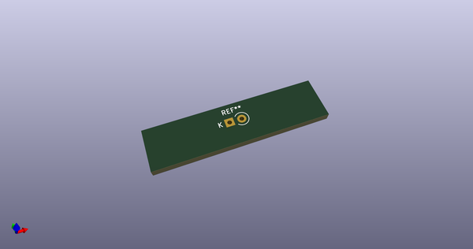
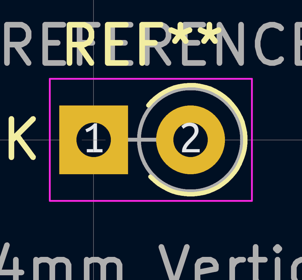
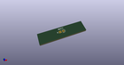

# OOMP Footprint  
## D_A-405_P2.54mm_Vertical_KathodeUp  by none  
  
oomp key: oomp_kicad_diode_tht_d_a_405_p2_54mm_vertical_kathodeup  
  
source repo at: [http://gitlab.com/kicad/kicad-footprints/blob/master/tmp/data//oomlout_oomp_footprint_src/Varistor.pretty/RV_Rect_V25S440P_L26.5mm_W8.2mm_P12.7mm.kicad_mod](http://gitlab.com/kicad/kicad-footprints/blob/master/tmp/data//oomlout_oomp_footprint_src/Varistor.pretty/RV_Rect_V25S440P_L26.5mm_W8.2mm_P12.7mm.kicad_mod)  
## Footprint  
  
  
  
  
| name | value | 
| --- | --- | 
| footprint name | D_A-405_P2.54mm_Vertical_KathodeUp | 
| footprint description | Diode, A-405 series, Axial, Vertical, pin pitch=2.54mm, , length*diameter=5.2*2.7mm^2, , http://www.diodes.com/_files/packages/A-405.pdf | 
| number of pads | 2 | 
| github path | http://github.com/kicad/kicad-footprints/blob/master/tmp/data//oomlout_oomp_footprint_src/Diode_THT.pretty/D_A-405_P2.54mm_Vertical_KathodeUp.kicad_mod | 
| oomp key | oomp_kicad_diode_tht_d_a_405_p2_54mm_vertical_kathodeup | 
| oomp bot github | https://github.com/oomlout/oomlout_oomp_footprint_bot/tree/main/tmp/data//oomlout_oomp_footprint_src/footprints/kicad_diode_tht_d_a_405_p2_54mm_vertical_kathodeup/working | 
## Images  
  
  
  
  
  
  
  
  
