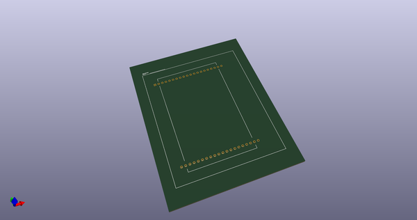
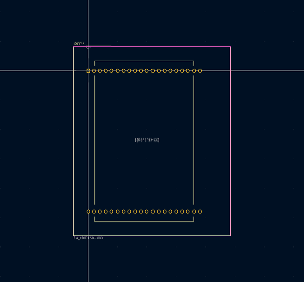
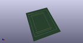
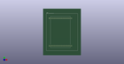

# OOMP Footprint  
## EA_eDIP160-XXX  by none  
  
oomp key: oomp_kicad_display_ea_edip160_xxx  
  
source repo at: [http://gitlab.com/kicad/kicad-footprints/blob/master/tmp/data//oomlout_oomp_footprint_src/Varistor.pretty/RV_Rect_V25S440P_L26.5mm_W8.2mm_P12.7mm.kicad_mod](http://gitlab.com/kicad/kicad-footprints/blob/master/tmp/data//oomlout_oomp_footprint_src/Varistor.pretty/RV_Rect_V25S440P_L26.5mm_W8.2mm_P12.7mm.kicad_mod)  
## Footprint  
  
  
  
  
| name | value | 
| --- | --- | 
| footprint name | EA_eDIP160-XXX | 
| footprint description | LCD-graphical display with LED backlight 160x104 RS-232 I2C or SPI http://www.lcd-module.com/fileadmin/eng/pdf/grafik/edip160-7e.pdf | 
| number of pads | 40 | 
| github path | http://github.com/kicad/kicad-footprints/blob/master/tmp/data//oomlout_oomp_footprint_src/Display.pretty/EA_eDIP160-XXX.kicad_mod | 
| oomp key | oomp_kicad_display_ea_edip160_xxx | 
| oomp bot github | https://github.com/oomlout/oomlout_oomp_footprint_bot/tree/main/tmp/data//oomlout_oomp_footprint_src/footprints/kicad_display_ea_edip160_xxx/working | 
## Images  
  
  
  
  
  
  
  
  
