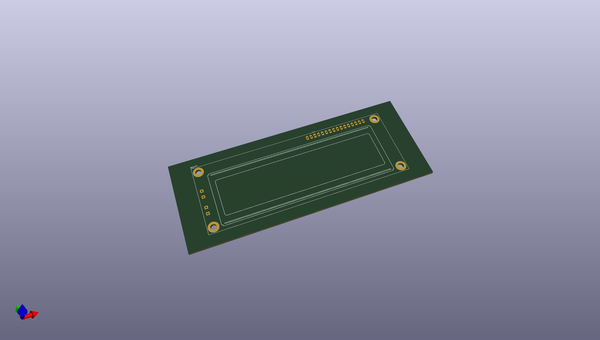
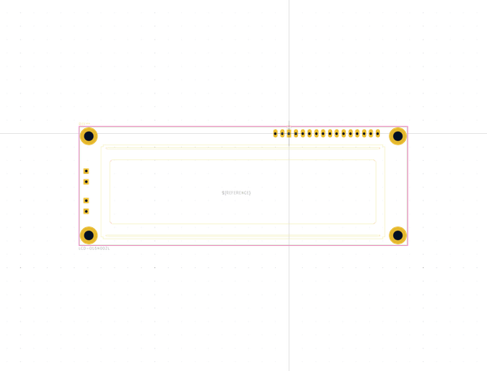
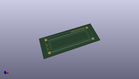
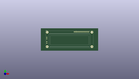

# OOMP Footprint  
## LCD-016N002L  by none  
  
oomp key: oomp_kicad_display_lcd_016n002l  
  
source repo at: [http://gitlab.com/kicad/kicad-footprints/blob/master/tmp/data//oomlout_oomp_footprint_src/Varistor.pretty/RV_Rect_V25S440P_L26.5mm_W8.2mm_P12.7mm.kicad_mod](http://gitlab.com/kicad/kicad-footprints/blob/master/tmp/data//oomlout_oomp_footprint_src/Varistor.pretty/RV_Rect_V25S440P_L26.5mm_W8.2mm_P12.7mm.kicad_mod)  
## Footprint  
  
  
  
  
| name | value | 
| --- | --- | 
| footprint name | LCD-016N002L | 
| footprint description | 16 x 2 Character LCD, http://www.vishay.com/product?docid=37299 | 
| number of pads | 24 | 
| github path | http://github.com/kicad/kicad-footprints/blob/master/tmp/data//oomlout_oomp_footprint_src/Display.pretty/LCD-016N002L.kicad_mod | 
| oomp key | oomp_kicad_display_lcd_016n002l | 
| oomp bot github | https://github.com/oomlout/oomlout_oomp_footprint_bot/tree/main/tmp/data//oomlout_oomp_footprint_src/footprints/kicad_display_lcd_016n002l/working | 
## Images  
  
  
  
  
  
  
